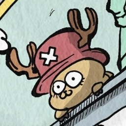
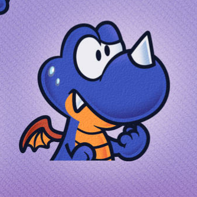
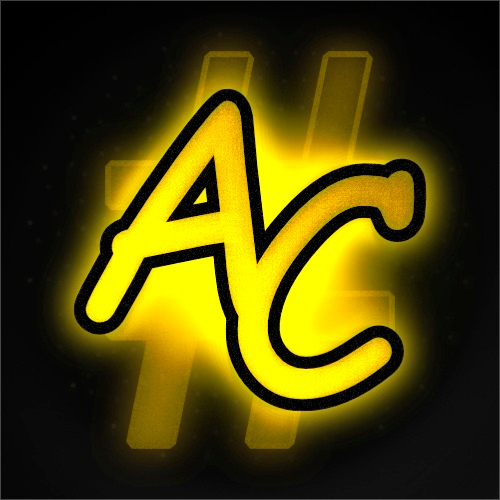

# Credits

--------------

{ width="200" }
/// caption
Perrohuevo
/// caption
Owner
///
///

{ width="200" }
/// caption
dewgong
/// caption
Head Moderator
///
///

{ width="200" }
/// caption
Gato-kun
/// caption
Moderator
///
///

{ width="200" }
/// caption
Kusa
/// caption
Moderator
///
///

{ width="200" }
/// caption
DanielKO
/// caption
Moderator
/// caption
DEV - System Font Replacer Plugin Creator
///
///
///

{ width="200" }
/// caption
Juanen
/// caption
DEV - StyleMiiU Plugin Creator 
///
///

{ width="200" }
/// caption
Alpha Craft
/// caption
DEV
///
///

{ width="200" }
/// caption
Nathaniel
/// caption
DEV
///
///

{ width="200" }
/// caption
Asty
/// caption
DEV
///
///

Credits to [wiki.hacks.guide](https://wiki.hacks.guide/wiki/Wii_U:Custom_themes) for some of the information in this page

This page was made with [Materials for MkDocs](https://squidfunk.github.io/mkdocs-material/)