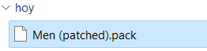
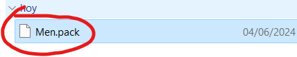

# Patching

--------------

You will need:

- [Rom Patcher JS](https://www.marcrobledo.com/RomPatcher.js/) or [Flips](https://github.com/Alcaro/Flips)
- Men.pack, Men2.pack, cafe_barista_men.bfsar
- A patch file
    - It can be one of the following formats .ips, .bps, .ups, .ppf, .aps, .rup

!!! warning

    **Save your unmodified Men.pack, Men2.pack, cafe_barista_men.bfsar files somewhere so you dont need to get your files again**

--------------

### Getting a patch file

You can join the Theme Café [discord server](https://discord.com/invite/2DNvH9db2A) to check for new themes or go to the [Theme Café Wesbsite](https://perrohuevo.wixsite.com/theme-cafe)

If you are in the Theme Café discord server

- You can check for [Static Themes here](https://discord.com/channels/1195784055296381020/1226501319976816671)
- You can check for [Animated Themes here](https://discord.com/channels/1195784055296381020/1233945865312538684)

??? info "Theme Café Website Info"

    The Theme Café website might not upload new themes very often, it's recommended to join the discord server

### Applying patches

1. In `Your original file here` select your **ORIGINAL UNMODIFIED** `Men.pack` / `Men2.pack` / `cafe_barista_men.bfsar` file you want to patch

2. For the Patch File select the **.ips, .bps, .ups, .ppf, .aps, .rup file** you got from downloading the theme that matches the name of the ROM file

3. Press Apply patch

    

        <label for="rom-patcher-input-file-rom">Your original file here:</label>
        <input type="file" id="rom-patcher-input-file-rom">
    

    

        

            
CRC32: 

        

        

            
MD5: &nbsp&nbsp

        

        

            
SHA-1: 

        

        

            
ROM:

            

        

    

    

        <label for="rom-patcher-input-file-patch">Your Patch File here:</label>
        <input type="file" id="rom-patcher-input-file-patch">
    

    

        <button id="rom-patcher-button-apply">Apply Patch</button>
    

    

        <a id="rom-patcher-download-link" style="display:none;">Download Patched ROM</a>
    

   

??? abstract "Credits"

    Credits to [Marcrobledo](https://www.marcrobledo.com/) for RomPatcher.js

It should now look like this

??? failure "Having issues?"

    - If you're getting a Source ROM checksum mismatch or a red "X", you can follow [Troubleshooting](../troubleshooting/troubleshooting.md#checksum-mismatch)

Finally remove the `(Patched)` from the name

Now do the same with the other files

!!! success

    You can now go to [Loading Custom Themes](loading.md)

    [Continue to Loading Custom Themes → ](loading.md){ .md-button .md-button--primary }