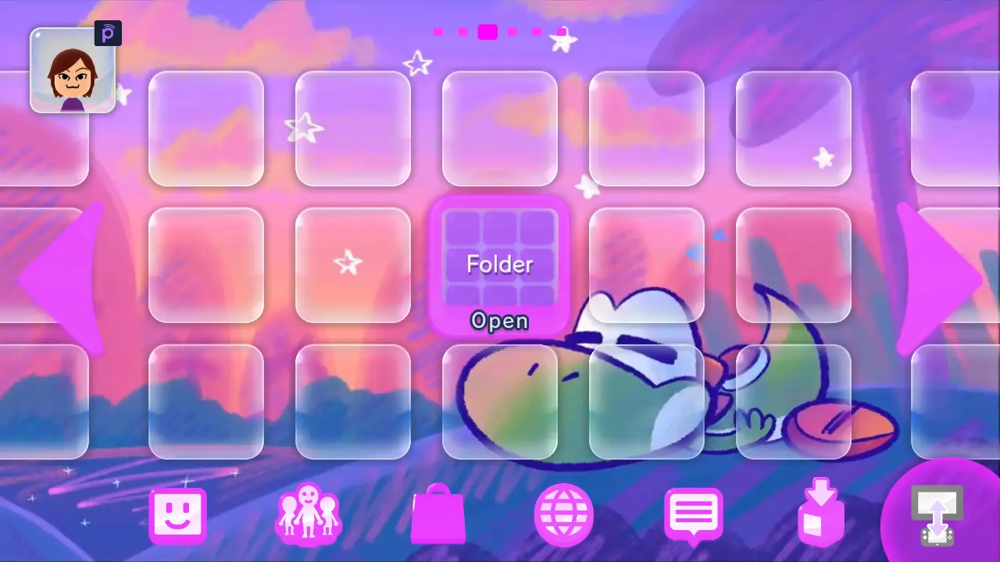
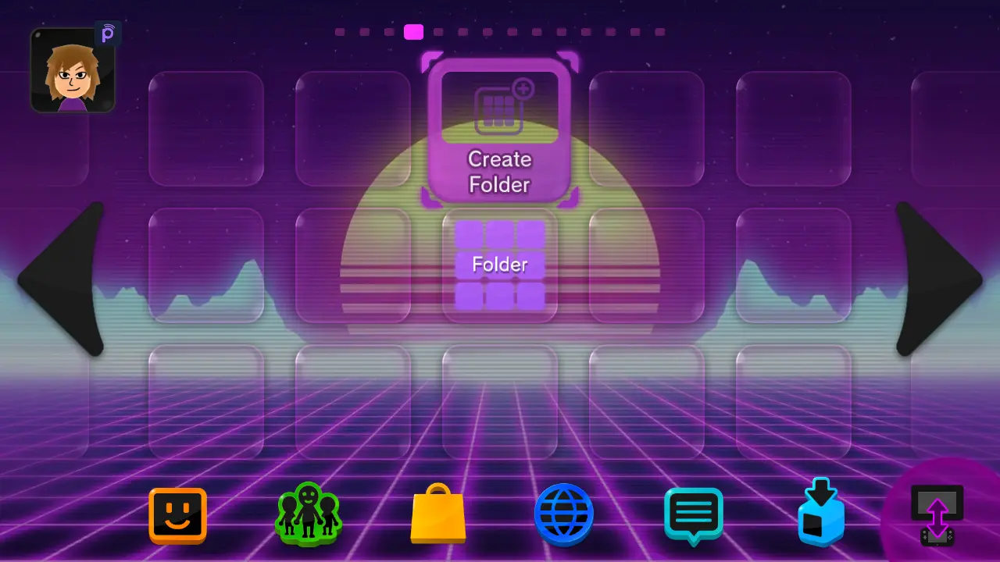
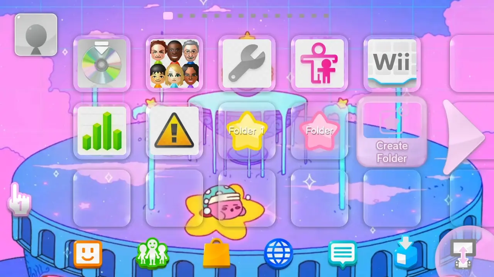
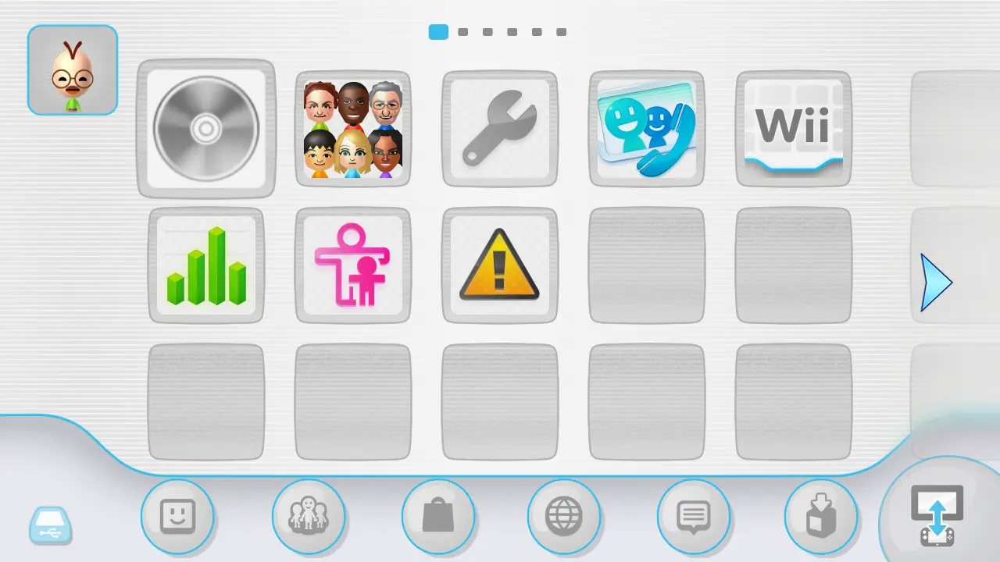
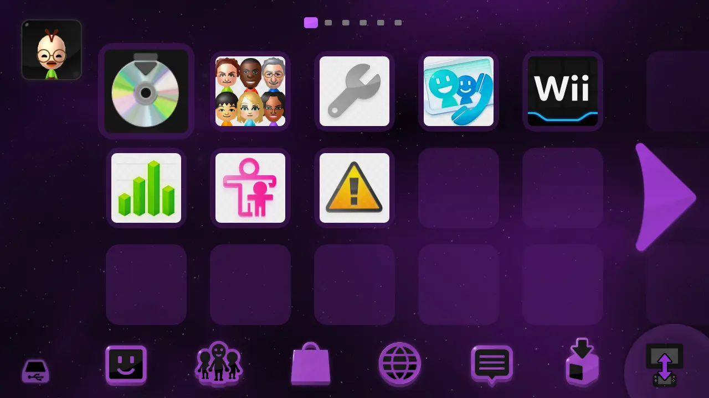

---
hide:
  - navigation
  - toc
comments: true
---

# Heading level 1
## Heading level 2
### Heading level 3
#### Heading level 4
##### Heading level 5
###### Heading level 6

# Calculator Example

Enter two numbers, click "Calculate," and see the result:

<div>
  <label for="num1">Number 1:</label>
  <input type="number" id="num1" />
  <label for="num2">Number 2:</label>
  <input type="number" id="num2" />
  <button onclick="calculate()">Calculate</button>
  <p>Result: <span id="result">0</span></p>
</div>

<script>
  function calculate() {
    const num1 = parseFloat(document.getElementById('num1').value) || 0;
    const num2 = parseFloat(document.getElementById('num2').value) || 0;
    document.getElementById('result').textContent = num1 + num2;
  }
</script>


separating

---------------

thing

**BOLD** *Italic* ***Both***

> Block Quote

---------------

> Block Quote
> 
> second line

---------------

> Block Quote
> 
> > Nested Block Quote

lists

> - Dot
> - Dot
> - Dot

(also works with *, +, )

- First item
- Second item
- Third item
    - Indented item
    - Indented item
- Fourth item 

> 1. Dot
> 2. Dot
> 3. Dot

images

{width=300}

code `code`

``` py title="pythontitle.py"
print("Python lines of code")
```

``` py linenums="1"
def bubble_sort(items):
    for i in range(len(items)):
        for j in range(len(items) - 1 - i):
            if items[j] > items[j + 1]:
                items[j], items[j + 1] = items[j + 1], items[j]
```

make into a link < >

<https://www.google.com>

emphazise links like [this](#)

## Admonitions

!!! note

    Hi

!!! abstract

    Hi

!!! info

    Hi

!!! tip

    Hi

!!! success

    Hi

!!! question

    Hi

!!! warning

    Hi

!!! failure

    Hi

!!! danger

    Hi

!!! bug

    Hi

!!! example

    Hi

!!! quote

    Hi

!!! script

    Hi

!!! star

    Hi

admonition without title

!!! note ""

    Hi

admonition with new title

!!! note "New title"

    Hi

admonition without description

!!! abstract "admonition without description"

!!! abstract "admonition without descriptionadmonition without descriptionadmonition without descriptionadmonition without descriptionadmonition without descriptionadmonition without descriptionadmonition without descriptionadmonition without descriptionadmonition without descriptionadmonition without descriptionadmonition without descriptionadmonition without descriptionadmonition without descriptionadmonition without descriptionadmonition without descriptionadmonition without descriptionadmonition without descriptionadmonition without descriptionadmonition without descriptionadmonition without descriptionadmonition without descriptionadmonition without descriptionadmonition without descriptionadmonition without description"

collapsable

??? note

    hi

collapsable but already expanded

???+ note

    hi


!!! info inline "Lorem ipsum"

    Lorem ipsum dolor sit amet, consectetur
    adipiscing elit. Nulla et euismod nulla.
    Curabitur feugiat, tortor non consequat
    finibus, justo purus auctor massa, nec
    semper lorem quam in massa.

Inline block

hello

Inline block

hello

Inline block

## annotations

annotations and nested annotations

Lorem ipsum dolor sit amet, (1) consectetur adipiscing elit.
{ .annotate }

1.  :man_raising_hand: I'm an annotation! (1)
    { .annotate }

    1.  :woman_raising_hand: I'm an annotation as well!

!!! note annotate "Phasellus posuere in sem ut cursus (1)"

    Lorem ipsum dolor sit amet, (2) consectetur adipiscing elit. Nulla et
    euismod nulla. Curabitur feugiat, tortor non consequat finibus, justo
    purus auctor massa, nec semper lorem quam in massa.

1.  :man_raising_hand: I'm an annotation!
2.  :woman_raising_hand: I'm an annotation as well!

## buttons

[This is a button](#){ .md-button } [this is a primary button → ](#){ .md-button .md-button--primary }

[this is a primary button](#){ .md-button .md-button--primary }

## content tabs

=== "Unordered list"

    * Sed sagittis eleifend rutrum
    * Donec vitae suscipit est
    * Nulla tempor lobortis orci

=== "Ordered list"

    1. Sed sagittis eleifend rutrum
    2. Donec vitae suscipit est
    3. Nulla tempor lobortis orci

embedded

!!! example

    === "Unordered List"

        ``` markdown
        * Sed sagittis eleifend rutrum
        * Donec vitae suscipit est
        * Nulla tempor lobortis orci
        ```

    === "Ordered List"

        ``` markdown
        1. Sed sagittis eleifend rutrum
        2. Donec vitae suscipit est
        3. Nulla tempor lobortis orci
        ```

## data tables

| Method      | Description                          |
| ----------- | ------------------------------------ |
| `GET`       | :material-check:     Fetch resource  |
| `PUT`       | :material-check-all: Update resource |
| `DELETE`    | :material-close:     Delete resource |

## text formatting

Text can be {--deleted--} and replacement text {++added++}. This can also be
combined into {~~one~>a single~~} operation. {==Highlighting==} is also
possible {>>and comments can be added inline<<}.

{==

Formatting can also be applied to blocks by putting the opening and closing
tags on separate lines and adding new lines between the tags and the content.

==}

- ==This was marked (highlight)==
- ^^This was inserted (underline)^^
- ~~This was deleted (strikethrough)~~

- H~2~O
- A^T^A

keyboard keys

++ctrl+alt+del++

## tooltips

[Hover me](https://example.com "I'm a tooltip!")


<div class="grid cards" markdown>

-   :material-clock-fast:{ .lg .middle } __Set up in 5 minutes__

    

    ---

    Install [`mkdocs-material`](#) with [`pip`](#) and get up
    and running in minutes

    [:octicons-arrow-right-24: Getting started](#)

-   :fontawesome-brands-markdown:{ .lg .middle } __It's just Markdown__

    ---

    Focus on your content and generate a responsive and searchable static site

    [:octicons-arrow-right-24: Reference](#)

-   :material-format-font:{ .lg .middle } __Made to measure__

    ---

    Change the colors, fonts, language, icons, logo and more with a few lines

    [:octicons-arrow-right-24: Customization](#)

-   :material-scale-balance:{ .lg .middle } __Open Source, MIT__

    ---

    Material for MkDocs is licensed under MIT and available on [GitHub]

    [:octicons-arrow-right-24: License](#)

-   :material-scale-balance:{ .lg .middle } __Open Source, MIT__

    ---

    Material for MkDocs is licensed under MIT and available on [GitHub]

    [:octicons-arrow-right-24: License](#)

-   :material-scale-balance:{ .lg .middle } __Open Source, MIT__

    ---

    Material for MkDocs is licensed under MIT and available on [GitHub]

    [:octicons-arrow-right-24: License](#)

-   :material-scale-balance:{ .lg .middle } __Open Source, MIT__

    ---

    Material for MkDocs is licensed under MIT and available on [GitHub]

    [:octicons-arrow-right-24: License](#)

</div>

a

!!! quote ""

    { align=right width=500 }

    # Lorem ipsum dolor sit amet, consectetur adipiscing elit. Nulla et euismod
    nulla. Curabitur feugiat, tortor non consequat finibus, justo purus auctor
    massa, nec semper lorem quam in massa.

    [this is a primary button](#){ .md-button .md-button--primary }

<div class="scroll-container">
  
  
  
  
  
</div> 

<style>
div.scroll-container {
  overflow: auto;
  white-space: nowrap;
  padding: 10px;
}

div.scroll-container img {
  padding: 10px;
  height 200px
}

.md-grid {
  margin-left:auto;
  margin-right:auto;
  max-width:100rem
}
</style>