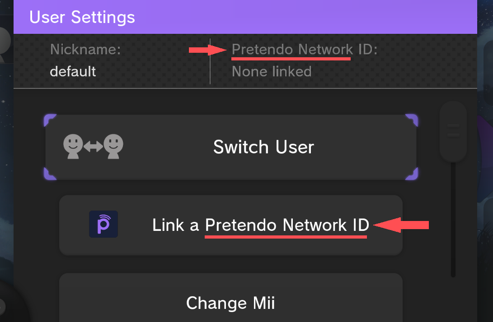
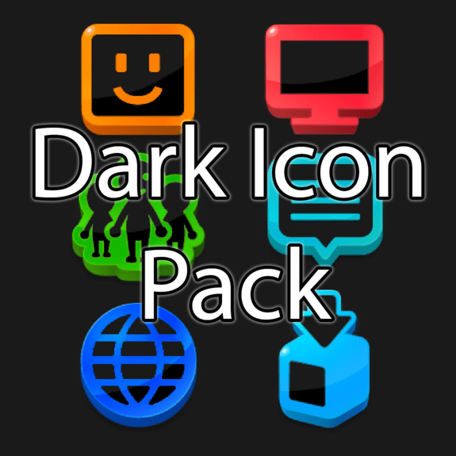

---
hide:
  - navigation
  - toc
---

-   [__Pretendo EU Language Patch__](pretendoeulanguage/index.md)

    { width="300" height="300" }

    ---

    This patch replaces all instances of "Nintendo Network" with "Pretendo Network"

    [info](pretendoeulanguage/index.md){ .md-button } [Download](https://drive.google.com/file/d/1V7SmmYZ4guc3KTpGnqDQs_kb5cRjOkT3/view?usp=sharing){ .md-button .md-button--primary }

-   [__Dark Icon Pack__](dark-icon-pack/index.md)

    { width="300" height="300"}

    ---

    Dark Applet Icons

    [info](dark-icon-pack/index.md){ .md-button } [Download](dark-icon-pack/dark-icon-pack.zip){ .md-button .md-button--primary }

