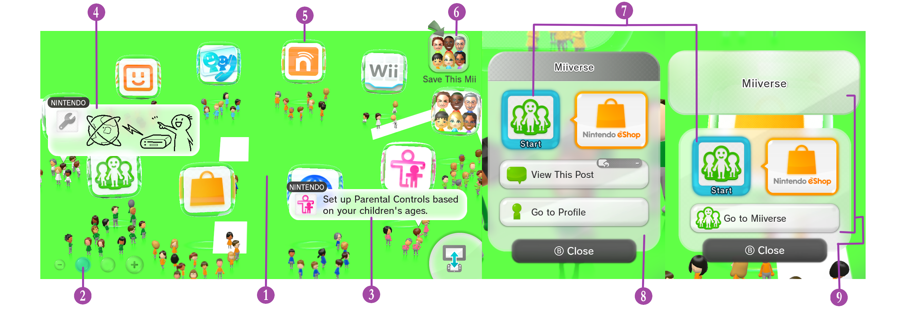
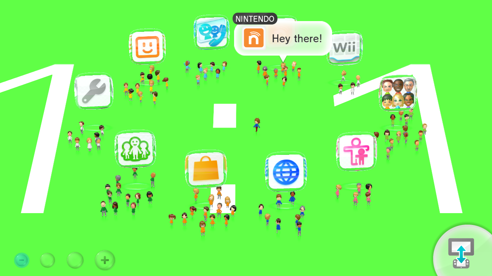

# Wara Wara Plaza

## Table of contents

WIP

### 1. Floor

{ width="426" height="240" }

`Men2.pack` > `Model` > `LoungeFloor.szs`

This is where the floor model is located

You can change the [Texture](../general/textures.md) of this by [replacing](../general/exportimport.md#replace) the texture `Floor_Alb`

----------------------

### 2. Button Scale

`Men.pack` > `Layout` > `BtnLoungeScale_00.szs`

WIP

----------------------

### 3. Speech Balloon

`Men2.pack` > `Layout` > `SpeechBalloon.szs`

WIP

----------------------

### 4. Speech Balloon Drawing

`Men2.pack` > `Layout` > `SpeechBalloonIllust.szs`

WIP

----------------------

### 5. App Floating Icon

`Men2.pack` > `Model` > `Cube00.szs`

WIP

----------------------

### 6. "Save This Mii"

`Men2.pack` > `Layout` > `BtnMiiWindow_02.szs`

WIP

----------------------

### 7. App Launch Icon

`Men2.pack` > `Layout` > `CommandLauncherIcon.szs`

WIP

----------------------

### 8. Post Info

`Men2.pack` > `Layout` > `CommandPosting.szs`

WIP

----------------------

### 9. App Info

`Men2.pack` > `Layout` > `CommandCube.szs`

WIP

----------------------