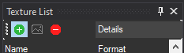

# Textures

## Adding a new texture

After opening the bflyt file of what you want to change the material's colors

- Click the green "+" button

    

- Select your image
- Change the format

???+ warning "Format"

    Make sure to add the texture the same format as the one you want to replace, this applies mostly for UI elements

    - If you are adding a texture for background, use T_BC1_SRGB

- Click OK

!!! failure "Don't delete textures"

    This will cause issues, and will problably corrupt your theme

## Change a Material's texture

- Open the Materials folder
- Select the Material you want to change the texture of
- Click on the Texture Maps tab
- Click Edit
- Choose the texture you want to use
- Click OK
- Save