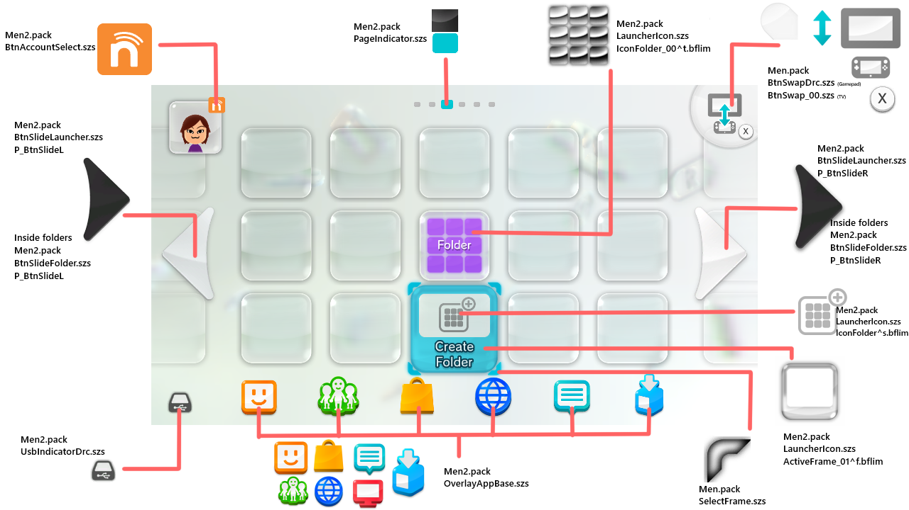

# Theme Creation

If you want to create your own themes, you will find tutorials here for the type of theme you want to make

## Essential Tools

- For Music

    - [Citric Composer](https://gota7.github.io/Citric-Composer/) 
    - [SequenceConvert](https://github.com/Gota7/SequenceConvert)

    !!! question "Music Creation Tutorial"

        If you want to learn how to make Custom Music for your theme follow 
        
        [Music](music/music.md){ .md-button .md-button--primary }

- For Themes

    - [Switch ToolBox](https://github.com/KillzXGaming/Switch-Toolbox?tab=readme-ov-file)

    ??? note "About Switch Toolbox"

        Switch Toolbox is a **Windows** program, if you are running a different OS [MISSING TEXT]

    In each of the following tutorials we provide base files patches for you to modify and make it easier to make themes

    ### Static

    

    [Static](static/tutorial.md){ .md-button .md-button--primary }

    ### Animated

    #### Frame-based

    <video controls>
    <source src="../themecreation/animated/imgs/frame/vf.mp4" type="video/mp4">
    </video>

    [Frame-based](animated/Frame.md){ .md-button .md-button--primary }

    #### Scrolling

    <video controls>
    <source src="../themecreation/animated/imgs/scrolling/vs.mp4" type="video/mp4">
    </video>

    [Scrolling](animated/Scrolling.md){ .md-button .md-button--primary }

## Advanced

WIP