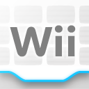
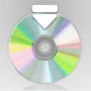

# Theme Creation

If you want to create your own themes, you will find tutorials here for the type of theme you want to make

## Index

- Static themes

    [Static](static/tutorial.md){ .md-button .md-button--primary }

- Animated Themes

    [Animated](animated/index.md){ .md-button .md-button--primary }

- Custom Music

    [Music](music/music.md){ .md-button .md-button--primary }

- Advanced

    [Advanced](#advanced){ .md-button .md-button--primary }

## Essential Tools

- For Music

    - [Citric Composer](https://gota7.github.io/Citric-Composer/) 
    - [SequenceConvert](https://github.com/Gota7/SequenceConvert)

    !!! question "Music Creation Tutorial"

        If you want to learn how to make Custom Music for your theme follow 
        
        [Music](music/music.md){ .md-button .md-button--primary }

- For Themes

    - [Switch ToolBox](https://github.com/KillzXGaming/Switch-Toolbox?tab=readme-ov-file)

    ??? note "About Switch Toolbox"

        Switch Toolbox is a **Windows** program, if you do not use Windows you'll have to look for a way to run Switch Toolbox on your machine

    In each of the following tutorials we provide base files patches for you to modify and make it easier to make themes

    ### Static

    

    [Static](static/tutorial.md){ .md-button .md-button--primary }

    ### Animated

    #### Frame-based

    <video controls>
    <source src="../themecreation/animated/imgs/frame/vf.mp4" type="video/mp4">
    </video>

    [Frame-based](animated/Frame.md){ .md-button .md-button--primary }

    #### Scrolling

    <video controls>
    <source src="../themecreation/animated/imgs/scrolling/vs.mp4" type="video/mp4">
    </video>

    [Scrolling](animated/Scrolling.md){ .md-button .md-button--primary }

## Advanced

???+ tip "Click here to hide"

    1.  Background: 
        
        `Men2.pack` > `Model` > `LoungeVR.szs`

        This is where the background image/animation is located

        [Static](static/tutorial.md){ .md-button .md-button--primary } [Animated](animated/index.md){ .md-button .md-button--primary }

        ??? info "Info"

            This only applies when using patches provided by the docs

        ----------------------

    2.  Applets: 

        
        
        `Men2.pack` > `Layout` > `OverlayAppBase.szs`

        This is where the App Icons at the bottom of the menu are located

        [Applets](misc/applets.md){ .md-button }

        ----------------------

    3.  Usb Indicator: 

        
        
        `Men2.pack` > `Layout` > `UsbIndicatorDrc.szs`

        This is where the Usb Indicator is located

        [Usb Indicator](misc/usbindicator.md){ .md-button }

        ----------------------

    4.  Start (Applets): 

        
        
        `Men2.pack` > `Layout` > `BtnOverlayApp_01.szs`

        This is where `Start` from the applets is located

        [Start](misc/applets.md#start){ .md-button }

        ----------------------

    5.  Select Frame: 
        
        

        `Men.pack` > `Layout` > `SelectFrame.szs`

        [Select Frame](misc/selectframe.md){ .md-button }

        ----------------------

    6.  Active Frame: 
        
        

        `Men2.pack` > `Layout` > `LauncherIcon.szs`

        This is the frame that shows up for creating a folder or starting an application

        [Active Frame](misc/activeframe.md){ .md-button }

        ----------------------

    7.  Button Swap: 
        
        

        `Men.pack` > `Layout` > `BtnSwap_00.szs` , `BtnSwapDRC.szs`

        There are 2 of these, one for the gamepad (`BtnSwapDRC.szs`) and one for the tv (`BtnSwap_00.szs`)

        [Swap](misc/swap.md){ .md-button }

        ----------------------

    8.  Button Swap Icons: 
        
        

        `Men.pack` > `Layout` > `BtnSwap_00.szs`

        [Swap Icons](misc/swap.md#button-swap){ .md-button }

        ----------------------

    9.  Arrow Right: 
        
        

        `Men2.pack` > `Layout` > `BtnSlideLauncher.szs`
        
        `P_BtnSlideR`

        [Arrow](misc/arrows.md){ .md-button }

        ----------------------

    10.  Arrow Left: 
        
        

        `Men2.pack` > `Layout` > `BtnSlideLauncher.szs`
        
        `P_BtnSlideL`

        [Arrow](misc/arrows.md){ .md-button }

        ----------------------

    11.  Page Indicator: 
        
        

        `Men2.pack` > `Layout` > `PageIndicator.szs`

        [Page Indicator](misc/pageindicator.md){ .md-button }

        ----------------------

    12.  Folder: 
        
        

        `Men2.pack` > `Layout` > `LauncherIcon.szs`

        `P_IconFolder_01`

        [Folder](misc/foldericon.md){ .md-button }

        ----------------------

    13.  Folder Create: 
        
        

        `Men2.pack` > `Layout` > `LauncherIcon.szs`

        `P_Folder`

        [Folder](misc/foldericon.md){ .md-button }

        ----------------------

    14.  Launcher Icons: 

        `Men2.pack` > `Layout` > `LauncherIcon.szs`

        ----------------------

    15.  Wii Menu Icon: 
        
        

        `Men2.pack` > `Model` > `SystemAppIcon.szs` > `Textures` > `AppIconWii`

        [Menu Icons](misc/menuicons.md){ .md-button }

        ----------------------

    16.  Disc Icon: 
        
        

        `Men2.pack` > `Model` > `SystemAppIcon.szs` > `Textures` > `AppIconWii`

        [Menu Icons](misc/menuicons.md){ .md-button }

        ----------------------

    17.  Network Icon: 
        
        

        `Men2.pack` > `Layout` > `BtnAccountSelect.szs`

        [Network Icon](misc/network.md){ .md-button }

        ----------------------

    17.  Account Button: 
        
        

        `Men2.pack` > `Layout` > `BtnAccountSelect.szs`

        [Button Account Select](misc/btnaccselect.md){ .md-button }

        ----------------------