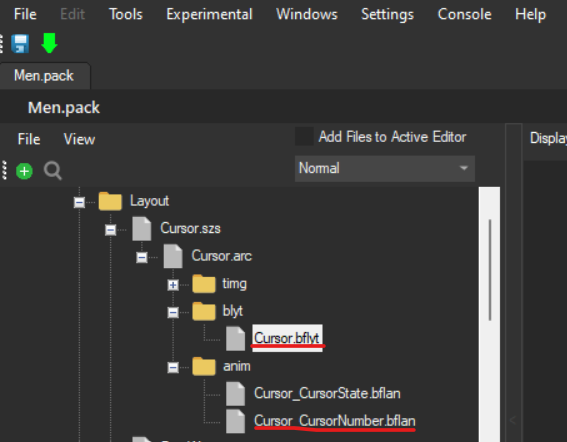
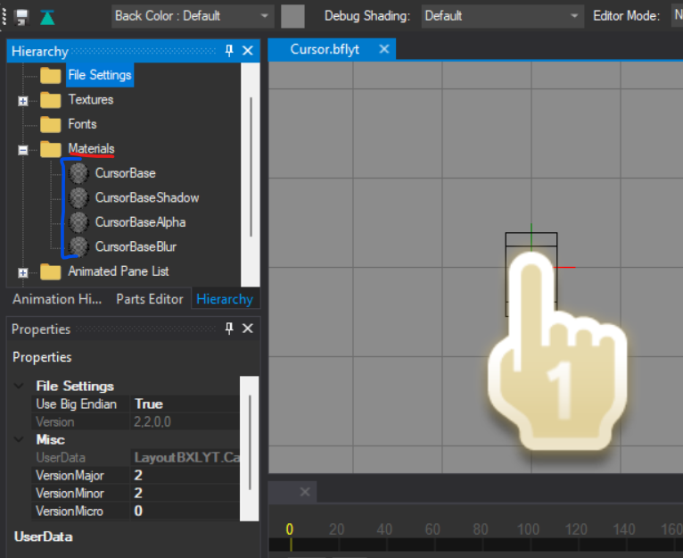
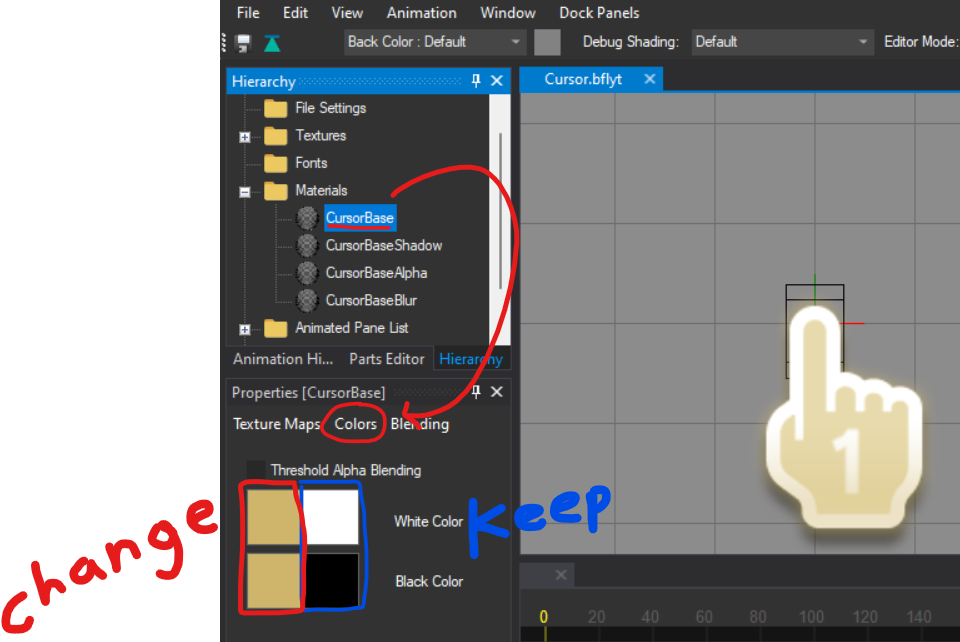
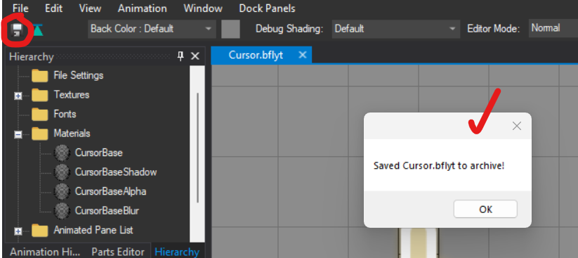
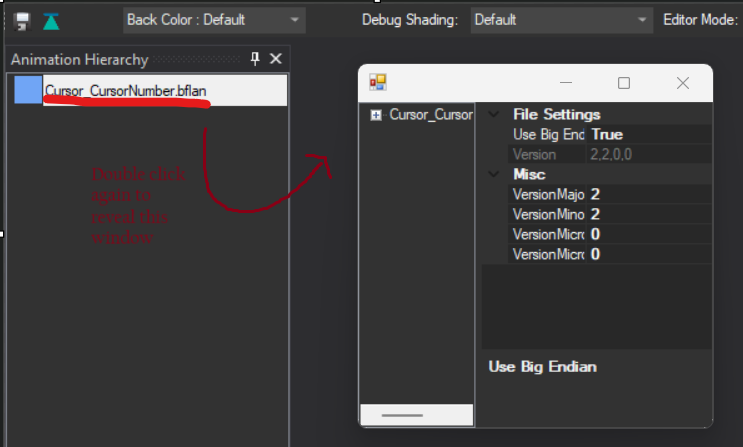
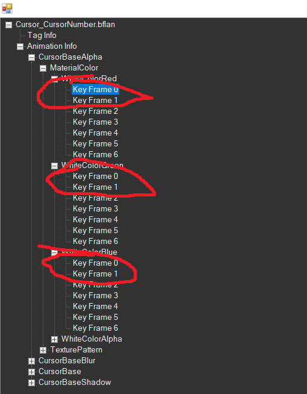
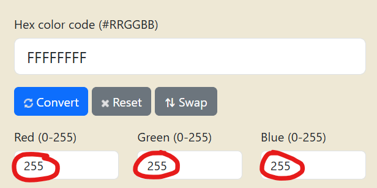
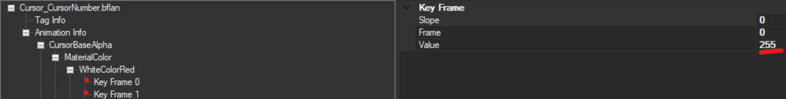
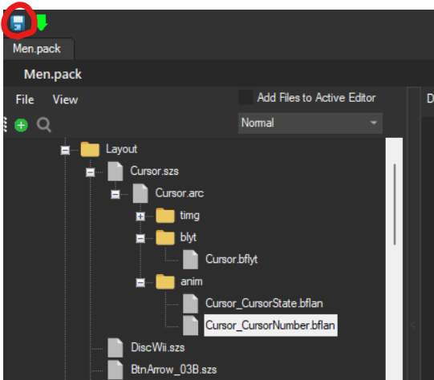

# Custom Cursor

## Changing Textures

Go to `Men.pack` > `Layout` > `Cursor.szs` > `Cursor.bflyt`

Add your [textures](../general/textures.md)

Change the texture of the materials:

- CursorBase
- CursorBaseShadow
- CursorBaseAlpha
- CursorBaseBlur

Go to animation hierarchy > Cursor_CursorNumber.bflan

Go to Animation Info and in

- CursorBaseAlpha
- CursorBaseBlur
- CursorBase
- CursorBaseShadow

in all of them change target from "Material" to "Pane"

Save

## Changing Colors

!!! abstract "Credits"

    Credits to the discord user *@dot0451* for the information in this page

## Requirements:

- [Switch Toolbox](https://github.com/KillzXGaming/Switch-Toolbox?tab=readme-ov-file)
- Your original Men.pack file

To get your original Men.pack file you will need to follow the tutorial on [Menu Files](../../install/files.md) and come back 

--------------

## Instructions:

- Drag Men.pack Into Swich Toolbox

- Search for "Cursor.szs"

Once you find it, double click it to reveal '**Cursor.arc**,  and double click '**Cursor.arc** to reveal more folders.

We will be focusing on two folders.
- **blyt**
- **anim**

And the files inside of them. **(Cursor.bflyt, Cursor_CursorNumber.bflan)**

We will focus on **blyt** folder for now. 

Double click the file **Cursor.bflyt**

Inside of it, there will be a **Materials** folder.

Open it, and it should reveal 4 files inside: **(CursorBase, CursorBaseShadow, CursorBaseAlpha, CursorBaseBlur)**

I recommend you start from top to bottom. 

You want to click on any of the four files, and click **color** at the bottom

## **Editing Cursor Colors**

### **Left Side Colors:**

When editing the colors on the left side of the cursor:

- ***Save your hex codes.*** 

Use a Notes app or a similar tool to record them. Your hex code(s) should be exactly 8 characters long. **This step is crucial for later on in the tutorial**, additionally, it ensures consistency across all four base files, especially if you’re creating a solid-colored cursor like the one in this tutorial, which is what most people go for.

??? note "Tip for dummies" 

    If you find colored hex codes online that are shorter than 8 characters (e.g. 6 characters), simply ask ChatGPT to convert them to 8 characters long.

### **Right Side Colors**:

The colors on the right side of the cursor should **always** be **black or white**.

- If these colors change while editing the left side colors, simply **change them back to black (00000000) or white**(FFFFFFFF). 
- Not doing so may cause the cursor to look weird. 

- Uncertain Changes:

    At times, you might notice no visible change after editing the cursor color.

    - It’s up to you to either leave it as is or revert it to its original state.
    - Currently, it’s unclear if this has a significant impact, but it’s worth noting.

These guidelines may be updated in the future. For now, adhering to them should make the editing process smoother."

In CursorBaseAlpha, the upper-left color is arguably the most important hex code. This color serves as a reference when updating the RGB (Red, Green, Blue) values in Cursor_CursorNumber.bflan within the anim folder. If the RGB colors in both files do not align, the changes made to the cursor’s outline in CursorBaseAlpha will not be properly reflected.

Here’s how I edited the colors for this particular cursor. There’s no right or wrong way to approach this—you can follow my method or take a completely different approach when editing the colors; the choice is yours. However, I recommend following my method if you're a beginner and just getting started.

After you are satisfied with how the cursor looks, click the save button located at the top left. It should say **Saved Cursor.bflyt to archive** and make sure you save the project in case anything happens.

--------------

## Animation Folder

Now time for the anim folder. There is a file called **Cursor_CursorNumber.bflan** double click it to open it.

Expand that window.

We will be focusing on these. They have RGB color coding that we need to change.

**Remember when I asked you to keep your hex codes somewhere? This is where they come in.**

A good website to change hex colors to RGB: [Click here!](https://www.rapidtables.com/convert/color/hex-to-rgb.html)

As you see, I'm using white so the RGB for Red, Green, and Blue are all 255

They will differ depending on your hex code.

**We will only change the Value of KeyFrame0, and KeyFrame1 for Red, Green, and Blue respectively**

Edit the values with the corresponding numbers that you get from that website.

Without closing the tab, save it.

Then close that window and save the project again.

!!! success

    That's it, you're done!

    Here's how it turned out

    
