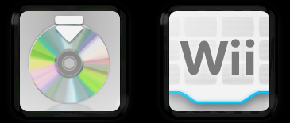

# Menu Icons

You can only modify the Disc and the Wii Menu Icons

Located in Men2.pack > Models > SystemAppIcon.szs

You can change the [Texture](../general/textures.md) of this by [replacing](../general/exportimport.md#replace) the textures in the `Texture` folder

`AppIconDisc` is for the Disc Icon

`AppIconWii` is for the Wii Menu Icon
