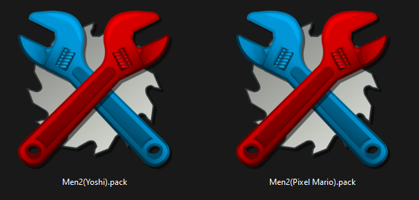
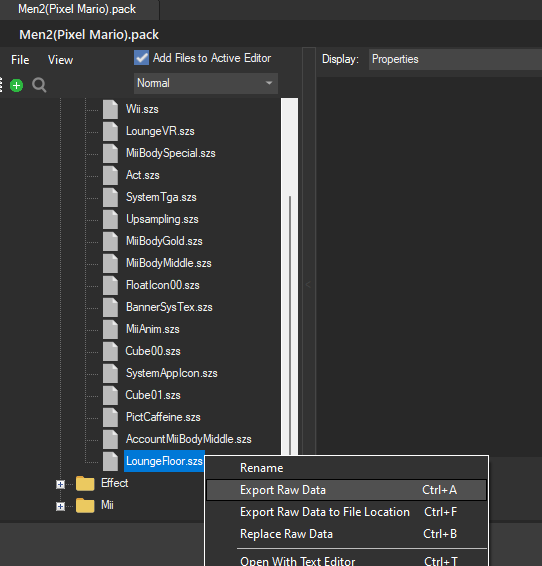
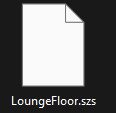

# How to mix themes

Index:

[Example 1](#example-1)

- A very detailed explanation, with steps and images

[Example 2](#example-2)

- A less detailed but more brief explanation

[TL:DR](#tldr)

- If you've been here before, here's a quick reminder of how to do it

In this tutorial you'll be able to mix and match a bunch of stuff from themes some worth mentioning

- UI
- App icons/colors
- Floor
- Backgrounds
- Etc...

## You need:

- The theme that you're editing (**Main**)
- The theme that you're getting resources from (**Source**)
- Know how to use toolbox or make themes

This guide assumes that you've made at least a theme before and you are somewhat familiar with the process and that you've already patched both themes with your files

### Example 1 

- A very detailed explanation, with steps and images

Let's say that you like the ⭐[Sleepy Yoshi Animated](https://discord.com/channels/1195784055296381020/1264809013279719476)⭐ theme but you wish it had a different floor, something like the floor on ⭐[Pixel Mario](https://discord.com/channels/1195784055296381020/1272742559302680606)⭐ , In this example I will be replacing the floor of Sleepy Yoshi (**Main**) with the one in Pixel Mario (**Source**)

#### Step 1
Open your **Source** theme and search for the file you want to use on your Main theme (In this case I want the floor from the Pixel Mario theme so I will search for LoungeFloor.szs), if you're unsure where the file is located you can check the tutorials or ask for [help](https://discord.com/channels/1195784055296381020/1205976336209027074)

#### Step 2

After locating the file you want to use on your main theme, right click and choose "Export Raw Data", then save it on your computer

You can repeat Step 1 and 2 if you want to change more files

We are done with the **Source** theme, you can close it now

#### Step 3
Open your **Main** theme and search for the file you want to change (In my case LoungueFloor.szs), then choose "Replace Raw Data" and use the file you saved earlier, you can now save your **Main** theme

#### Results
You can now move your file to your SD as usual and try out the theme

<video controls>
<source src="../imgs/mixthemes/vm1.mp4" type="video/mp4">
</video>

✨ If you are going to upload a theme using resources from other people **please credit them** ✨  

*Some themes may lead to unexpected results*
*Be aware that combining heavy themes can be too much for the console to handle and can lead to a black screen or a crash*

### Example 2

- A less detailed but more brief explanation

Let's say you like the [Pixel Cyber Punk](https://discord.com/channels/1195784055296381020/1272306793585971381) theme but it's static, and you want something more animated like [Pixel Mario](https://discord.com/channels/1195784055296381020/1272742559302680606), In this example we'll be moving the animation from Pixel Mario (**Source**) to Pixel Cyber Punk (**Main**)

You are already familiar with the steps so i'll keep it brief

Open your **Source** theme and search for the file (In this case is FolderBase), right click and export, save the file on your computer, then open your **Main** theme and search for the file, right click and replace, then save, boot up your theme and check it out

<video controls>
<source src="../imgs/mixthemes/vm2.mp4" type="video/mp4">
</video>

### TL:DR

- This is a very simple summary of the tutorial, if you want more details please start from [here](#example-1)

You need 2 themes (Main: Your theme, Source: The theme you want something from)

1. Open your Source theme, search for the file right click then export and save it on your pc
2. Open your Main theme, search for the file right click then replace and save your theme
3. Test your theme
