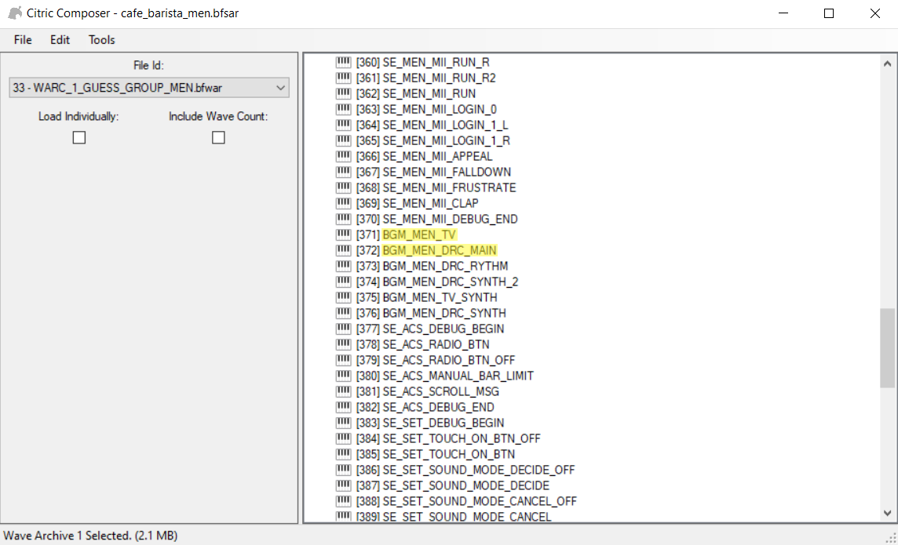

# Music

---------------

## What you need

- A program that can export audio file as `.WAV`
    - For example [Audacity](https://www.audacityteam.org/)

- [Citric Composer](https://gota7.github.io/Citric-Composer/) 
- [SequenceConvert](https://github.com/Gota7/SequenceConvert)

### Base

We will be working with this base

[Download Base (Music)](../tutorials_old/base/music/cafe_barista_men%20(MII%20SFX).bps){ .md-button .md-button--primary }

???+ info "Music Lenght"

    With this base you will be able to make custom music up to 1:55 at 32000khz Stereo before the file is too large to work with

    ??? info "I want to make longer music"

        You can also use the following base

        [Download Base (Music Without MII SFX)](../tutorials_old/base/music/cafe_barista_men%20(NO%20MII%20SFX).bps){ .md-button .md-button--primary }

        This base does not contain Mii SFX and will get you about 2:26 at 32000khz Stereo

        ??? info "My music is still longer than 2:26"

            If you want to make longer music you can export your music it at a lower sample rate and use Mono instead of Stereo, what matters is that the size of the file is not too large

Apply the patch to a copy of your `cafe_barista_men.bfsar` file ([Patching](../../install/patching.md)) and come back here when you're done

### Exporting Music as WAV

Use the program of your choice to export your music as a `.WAV` file

The best settings are

- Sample Rate: 32000 kHz
- Channels: Stereo
- Encoding: Signed 16-bit PCM

### Citric Composer

#### Adding your music

- Launch Citric Composer
- Open your cafe_barista_men.bfsar already patched with the provided [Base](#base)
- Double click `Wave Archives`
- Double click `[1] WARC_1_GUESS_GROUP_MEN`
- A new window will open

    

- Double click `Waves`
- Scroll to the bottom to find `[302] WAV_302_GUESS_BANK_MEN_BGM`
- Right click `[302] WAV_302_GUESS_BANK_MEN_BGM`
- Click replace
- Choose your `.WAV` file
- Wait for it to change the name to `[302] {Unknown Wave Name}`

    

- Click file on the top left corner
- Click Save

You can now close this window

#### Looping

- Go back to the original window of Citric Composer
- Double click `Sound Sequences`
- Scroll until you find `[371] BGM_MEN_TV` and `[372] BGM_MEN_DRC_MAIN`

    

- Right click `[371] BGM_MEN_TV`
- Click `Export`
- Save the `BGM_MEN_TV.bfseq` file on your device
- Right click `[372] BGM_MEN_DRC_MAIN`
- Click `Export`
- Save the `BGM_MEN_DRC_MAIN.bfseq` file on your device

!!! warning "Don't close Citric Composer yet"

    We are not done using Citric Composer but we need to convert the files

#### Sequence Convert

Now we will use [SequenceConvert](https://github.com/Gota7/SequenceConvert/raw/master/Download/SequenceConvert.exe)

- Drag `BGM_MEN_TV.bfseq` and drop it on SequenceConvert.exe
- Drag `BGM_MEN_DRC_MAIN.bfseq` and drop it on SequenceConvert.exe

This will create the `.fseq` files we need

Open `BGM_MEN_TV.fseq` with the text editor of your choice

``` title="BGM_MEN_DRC_MAIN.bfseq" linenums="1" hl_lines="19"
;;;;;;;;;;;;;;;;;;;;;;;;;;;;;;;;;;;;;;;
;
; BGM_MEN_TV.fseq
;     Generated By Gota's Sound Tools
;
;;;;;;;;;;;;;;;;;;;;;;;;;;;;;;;;;;;;;;;

SMF_Barista_Main_TV_Begin:
	alloctrack 57281
SMF_Barista_Main_TV_Start:
	timebase 96
	opentrack 14, SMF_Barista_Main_TV_Begin
SMF_Barista_Main_TV_Track_14:
	notewait_on
	prg 5
	volume 127
	pan 64
SMF_Barista_Main_TV_Track_14_LoopStart:
	fn5 120, 1000
	wait 100
	jump SMF_Barista_Main_TV_Begin
	fin
 
SMF_Barista_Main_TV_End:
```

You need to change the highlighted line **19**: `fn5 120, 1000`

- *120* is the volume
- *1000* is the music lenght

To calculate and update the music lenght value in order to match the length of your song you will want to take the number of seconds your song is and multiply that value with 192.

??? example

    - A 1:55 song has 115 seconds
    - Multiply `115 x 192`
    - The result is `22080`
    - In this example the music lenght value would be changed to `fn5 120, 22080`

- Now save your changes

Now open `BGM_MEN_DRC_MAIN.fseq` with the text editor of your choice, the process is the same but if you want to see it click "Process" below

??? question "Process"

    ``` title="BGM_MEN_DRC_MAIN.bfseq" linenums="1" hl_lines="19"
    ;;;;;;;;;;;;;;;;;;;;;;;;;;;;;;;;;;;;;;;
    ;
    ; BGM_MEN_DRC_MAIN.fseq
    ;     Generated By Gota's Sound Tools
    ;
    ;;;;;;;;;;;;;;;;;;;;;;;;;;;;;;;;;;;;;;;

    SMF_Barista_Main_DRC_Begin:
        alloctrack 15
    SMF_Barista_Main_DRC_Start:
        timebase 96
        opentrack 1, SMF_Barista_Main_DRC_Begin
    SMF_Barista_Main_DRC_Track_1:
        notewait_on
        prg 5
        volume 127
        pan 64
    SMF_Barista_Main_DRC_Track_1_LoopStart:
        fn5 120, 1000
        wait 100
        jump SMF_Barista_Main_DRC_Begin
        fin
    
    SMF_Barista_Main_DRC_End:
    ```

    You need to change the highlighted line **19**: `fn5 120, 1000`

    - *120* is the volume
    - *1000* is the music lenght

    To calculate and update the music lenght value in order to match the length of your song you will want to take the number of seconds your song is and multiply that value with 192.

    ??? example

        - A 1:55 song has 115 seconds
        - Multiply `115 x 192`
        - The result is `22080`
        - In this example the music lenght value would be changed to `fn5 120, 22080`

    - Now save your changes

Now that you have edited both `BGM_MEN_TV.fseq` and `BGM_MEN_DRC_MAIN.fseq` files

- Drag `BGM_MEN_TV.fseq` and drop it on SequenceConvert.exe
- Drag `BGM_MEN_DRC_MAIN.fseq` and drop it on SequenceConvert.exe

This will turn the `.fseq` files back to `.bfseq`

#### Replacing files

Go back to Citric Composer

- Right click `[371] BGM_MEN_TV`
- Click `Replace`
- Replace with the `BGM_MEN_TV.bfseq` you just converted
- Right click `[372] BGM_MEN_DRC_MAIN`
- Click `Replace`
- Replace with the `BGM_MEN_DRC_MAIN.bfseq` you just converted
- Click `File` on the top left corner
- Save

!!! success

    You can now test your music [SDCafiine](../../install/loading.md#sdcafiine)

!!! bug "If you are having issues"

    - If the console freezes before loading the Wii U menu follow [Freezing](../../troubleshooting/troubleshooting.md#freezing)
    - If the song is not looping properly follow [Looping](#looping)
    