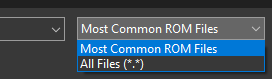

# Sharing

If you want to share your themes, first you'll need to make them into a patch

--------------

## ***Flips***

!!! info

    The patches created using Flips instead of RomPatcher.js are much more optimized and prioritize efficiency over speed. If you want to reduce the file size of your patch, It is strongly recommended using Flips to create your patches.

### What you need

1. [Flips](https://github.com/Alcaro/Flips/releases)
1. Your ORIGINAL UNMODIFIED menu files
2. Your modified file

### Guide

1. Extract the zip files
2. Open Flips.exe
3. Click *"Create Patch"*
4. Select your ORIGINAL UNMODIFIED file
    - You might need to change the setting here and select *"All files (*.*)"*

    

5. Select your modified file
6. Save your file
    - You should now see this

    

!!! success

    You are now ready to share your theme

??? question "Rompatcher.js"

    Be aware that patches made with Rompatcher.js are unoptimized and their size will be higher than patches made with flips

    Please only use this method in case you are unable to run Flips in your machine

    ??? note "Tutorial"

        ## ***Rompatcher.js***

        ### What you need

        1. Your ORIGINAL UNMODIFIED menu files
        2. Your modified file

        ### Guide

        1. Go to [Rompatcher.js](https://www.marcrobledo.com/RomPatcher.js/)
        2. Click on creator mode
            
            

        3. In Original ROM select your ORIGNAL UNMODIFIED file
        4. In Modified ROM select your modified file
        5. Click on Create Patch

        !!! success

            You are now ready to share your theme

        --------------