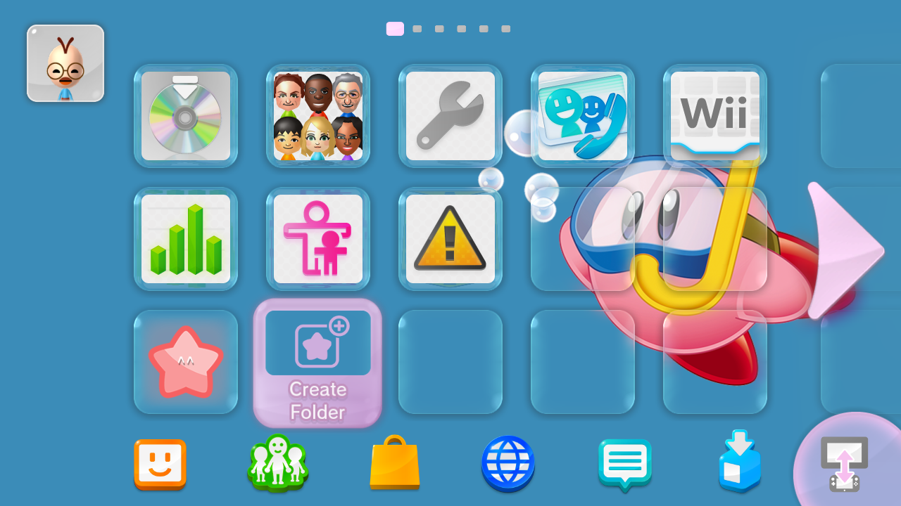
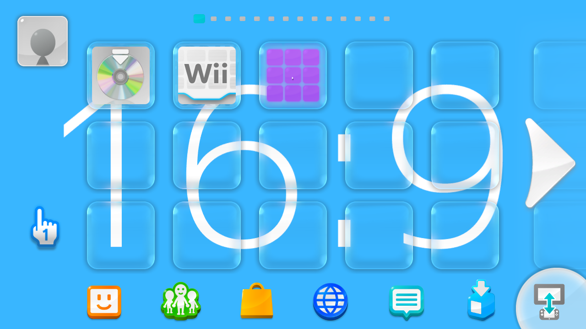
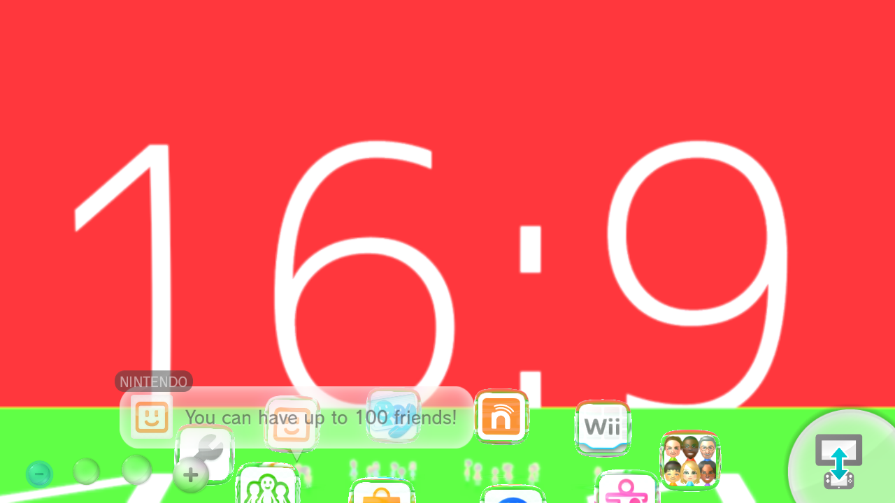
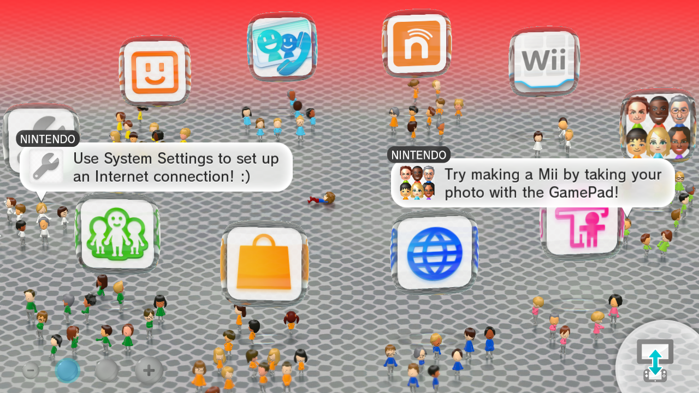
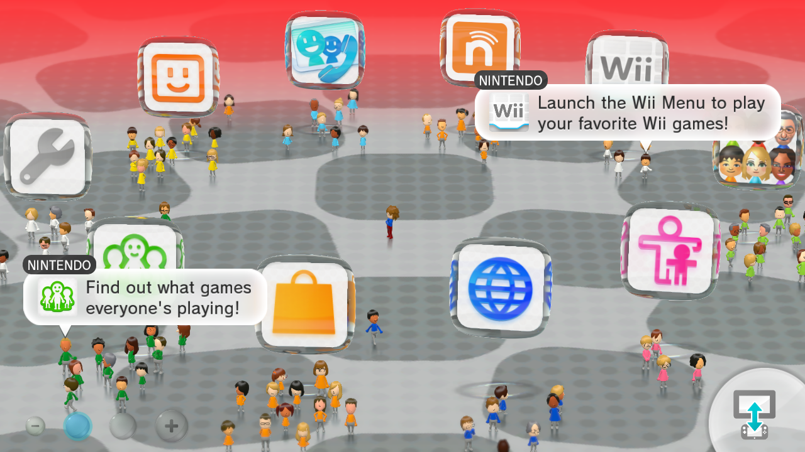
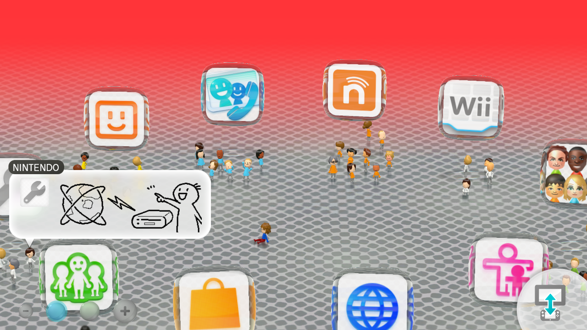

# Custom Theme

This is a Custom Theme

Custom themes can have a 2D non moving image, or be animated by adding texture animations to the models

-----------------------

## What you need

- [Switch Toolbox](https://github.com/KillzXGaming/Switch-Toolbox/releases/tag/Final)

### Template

We will be working with this template

[:fontawesome-solid-download: Download template](templates/Men2.bps){ .md-button .md-button--primary }

Apply the patch to a copy of your `Men2.pack` file ([Patching](../../install/patching.md)) and come back here when you're done

-----------------------

### Launcher

Open the patched template with [Switch Toolbox](https://github.com/KillzXGaming/Switch-Toolbox/releases/tag/Final)

- Go to Common
- Go to Model
- Double click `LoungueVR.szs`
- Double click `gsys.bfres`
- Go to Textures
- Right click `bg02` and select `Replace`
- Choose the image you want to use as background for the Menu

    ???+ info "Recommended Image Resolution"

        1280x720

- Save

??? question "Where is this image displayed?"

    This image will be displayed here

    
    
-----------------------

### Screen Transition

We are now going to change the image that's between the Wara Wara Plaza and the launcher

- Close `LoungueVR.szs`
- Go back to the `Models` folder
- Double click `FloatIcon00.szs`
- Double click `gsys.bfres`
- Go to Textures
- Right click `White_00` and select `Replace`
- Choose the image you want to use as background for the Menu

    ??? info "Recommended Image Resolution"

        1280x720

- Save

??? question "Where is this image displayed?"

    This image will be displayed here

    

-----------------------

### Floor

Now we need to change the texture of the floor

There are two ways you can have the floor

=== "Tiled"

    

    - Close `FloatIcon00.szs`
    - Go back to the `Models` folder
    - Double click `LoungeFloor.szs`
    - Double click `gsys.bfres`
    - Go to Textures
    - Right click `Floor_Alb` and select `Replace`
    - Choose the image you want to use as background for the Menu

        ??? info "Recommended Image Resolution"

            1024x1024

    - Save

=== "Stretched"

    

    - Close `FloatIcon00.szs`
    - Go back to the `Models` folder
    - Double click `LoungeFloor.szs`
    - Double click `gsys.bfres`
    - Go to `Models`
    - Go to `LoungeFloor`

    - Download the following floor model

    [:fontawesome-solid-download: Download Stretched Floor Model](templates/LoungeFloor.dae){ .md-button .md-button--primary }

    - Right Click `Objects` and select `Import Static Object`
    - Import using the `LoungeFloor.dae` you just downloaded
    - Click `OK`

    In Model Settings

    - Uncheck `Use Material`
    - Check `Enable Vertex Colors`

    Now go to the `Inject Mode` Tab

    - Check `Keep Original Skin Count`

    Go back to the Model Settings tab and click Save

    - Open the Objects folder
    - Delete the `floor__m_floor` object
    - Go back to Textures
    - Right click `Floor_Alb` and select `Replace`
    - Choose the image you want to use as background for the Menu
    
    !!! warning "When importing the image, import it in format `T_BC1_SRGB`"

    ??? info "Recommended Image Resolution"

        2000x2000

    - Save

### Gradient

There's also the option to use a gradient to make the transition between the screens smoother

Still in `LoungeFloor.szs > gsys.bfres > Textures`

- Right click `Gradient` and click `Export`

You can edit the color of the gradient to your liking in the program of your choice, when you are done simply

- Right click `Gradient`, click `Replace`

select your new texture and make sure you import it in format `TCS_R8_G8_B8_A8_SRGB`

??? question "How does the gradient look like?"

    

??? note "If you do not want to use a gradient"

    Right click the next button and click `Save Link As...` and download the `Blank.png` file

    [:fontawesome-solid-download: Download blank texture](imgs/template/Blank.png){ .md-button .md-button--primary }

    - Right click `Gradient` , Click `Replace` and select the blank texture you just downloaded
    - Import it in format `TCS_R8_G8_B8_A8_SRGB`

    The gradient should no longer be visible

    

-----------------------

!!! info "Adding Animations"

    If you want to add animations to your theme follow

    [Animations](anim.md){ .md-button .md-button--primary }
    
!!! success

    Your Custom theme is now done

    For more advanced changes go to

    [Advanced](../advanced/launcher.md){ .md-button .md-button--primary }