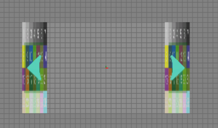
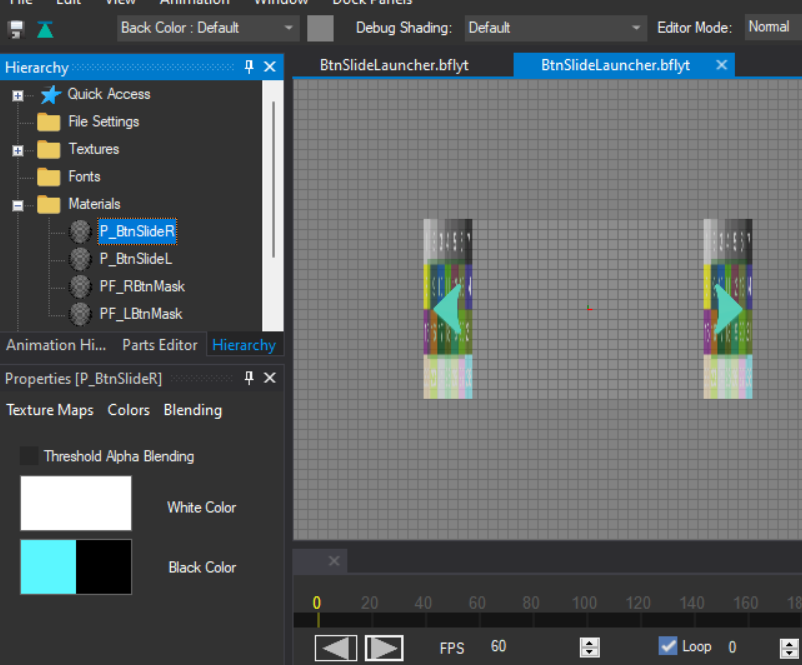

**Arrow Colors**

1. To modify the arrow colors first we need to locate them, if you are using one of my themes as a base they may be located inside **Men2.pack** then **layout** and then look for the file **BtnSlideLauncher**

    

2. Make sure that the base arrow is black just like in the image below, this will make this process way easier

    

    why do you want it to be black? because when modifying color it detects the dark colors and changes them into another color

3. We will look for materials, **P_BtnSlideR** and **P_BtnSlideL** are the important ones and the ones we will modify

    

4. after clicking the material you will click **Colors** and modify **Black Color**

    

    for example lets change it to **pink** or the color you want

    **Reminder: Dont change the color on the right, this will change the lighting causing an error displaying the arrow image**

5. now save everything and test

    Now if you did it correctly you will end up with different colors on the arrows

    

If you want to change the colors for anything else just follow the same logic