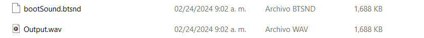

# Bootsound

!!! danger "WARNING: THIS IS DANGEROUS"

    This guide was made by Perrohuevo and is here for archival purposes, and hidden away intentionally, you should **NOT FOLLOW THIS GUIDE**, if you follow this guide you accept that you run the risk of **BRICKING** your Wii U to a state that it may not be recoverable, ****WE ARE NOT RESPONSIBLE FOR WHAT YOU DO WITH YOUR CONSOLE****

    ??? warning "I understand the risks and I accept that my Wii U has high chances to get bricked following this tutorial"

        1. Use wav2btsnd to convert files into bootsound

            here is a link: <https://gbatemp.net/threads/wav2btsnd-simple-tool-to-create-btsnd-files.447896/>

        2. Inside the wav2btsnd folder create a text file and put this inside

            **This will create the file with the correct parameters already**

            `ffmpeg.exe -i INPUT.wav -c:a pcm_s16le -ar 48K -ac 2 -bitexact Output.wav

            java -jar wav2btsnd.jar -in Output.wav -out bootSound.btsnd`

        3. Save it as a **.bat** file

            like this

            

            **Another alternative for this method could be**

            - Use this website to convert the audio into RIFF WAVE files, 48000khz, 16bit stereo: <https://onlineaudioconverter.com/>

            Make this setup

            

            - Then run this command in **.bat**

            `ffmpeg.exe -i INPUT.wav -bitexact Output.wav

            java -jar wav2btsnd.jar -in Output.wav -out bootSound.btsnd`

            *The first line isnt necessary but i like doing it that way*

            You should end up with this

            

        **WARNING**

        1. Your audio file must be short, it cant be too long, you can use **9 seconds** as a default

        **Max 18 seconds**

        2. This can cause **BRICKS** please try first on **cemu** or **aroma's sdcaffeine** if it doesn't crash then you are safe to try it on the nand

        3. Seems like bootsound doesnt work on **aroma's sdcaffeine** cause it loads the default theme first and then replaces it so you cant hear the custom bootsound

        **Do this at your own risk, I will not take responsability for anything**