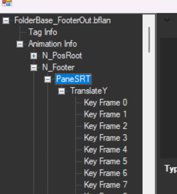
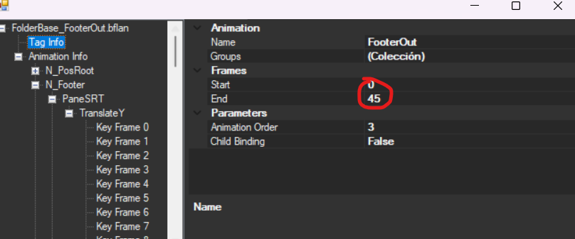
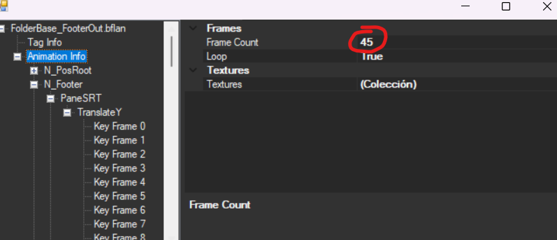
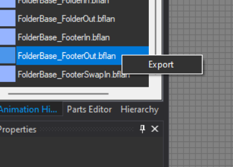

You will need:

- Structure file as a base for frame by frame animations (it will be at the end of this tutorial)
- Your animation separated in frames (pictures)

1. After downloading/applying the file at the end of this tutorial search for FolderBase.szs > FolderBase.bflyt and open it, you will see something like this

2. Open Animation Hierarchy

3. Select **FooterOut.bflan**

4. Navigate to N_Footer > Translate Y

Now we will make a little math, its simple dont worry

Each frame of your animation takes 2 key frames

so multiply the amount of frames your animation contains and substract 1

3 * (Amount of Frames) - 1

Example:
Your animation contains 15 Frames

3 * (15) - 1 = **44**

The result you got will be the End frame on Taginfo and Animation info

5. Copy that value and place it on

**Taginfo** and **Animation info**

(its **44** not **45** im just dumb ill fix this later)

we have now set the amount of frames that will be shown

6. Close that and on Animation Hierarchy left click FooterOut.bflan and click export

7. On switch toolbox open anim we will work with FooterIn.bflan

8. Left click it and then select "Replace Raw Data"

we will replace it with FooterOut.bflan

after doing that now the animation will play when opening folders

9. Now you can add your frames as BC1_UNORM/BC3_UNORM

suggested: BC1_UNORM

10. After adding all of your frames open the materials folder, there you will see all the Frames available

11. After adding all your frames, go and test it out

You can test it directly on switch toolbox

**To test**

Go into animation Hierarchy, select footerout or footerin and press play

<video controls>
<source src="../imgs/framebyframe/vf.mp4" type="video/mp4">
</video>

Use this file as a base "You will need to patch a Men2.pack to use it" [here](../../install/files.md)

[Download Base](base/framebyframe/Men2.bps){ .md-button } 

it contains 30 frames