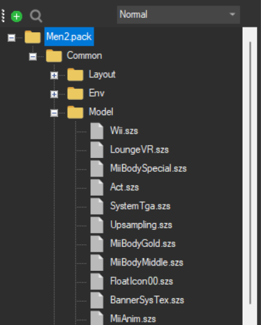

**Quick tutorial: How to make your own minimalist theme**

I'll assume you already got an editing software for **Men.pack, Men2.pack** files

You can use **Switch Toolbox** search it up

1. Open **Men2.pack** file and open **Model**

    

2. the only files we will edit are **LoungeVR** and **FloatIcon00**

    **LoungeVR** is the background on the mii's plaza thing (not gamepad)
    **FloatIcon00** is the background on the gamepad}

    

3. Lets begin with **FloatIcon00**

    open the **Textures** folder and replace the **heisjustlikeme** image with an image you like 

    (i usually use **1440 x 900** size images)

    

4. Now we will do kinda the same with **LoungeVR**

    Open the **Textures** folder and replace the **bg02** image

    

    How to edit the **LoungeVR** background?

    You could use an image editing software such as **GIMP**

    heres the **Midna Theme** background, just change the paint brush thing with whatever you like, just use it as reference to know where the center is

    

5. You are basically done, if you want to change the colors of the icons and stuff like that, its too much work to explain it but basically modify the **Layout** folder inside both **Men.pack, Men2.pack** files

You can just export one of mine and replace it with yours

**Minimalist themes are kinda outdated so i deleted them from the server, but if you ever want to make one of those just delete the picture from a static theme**

