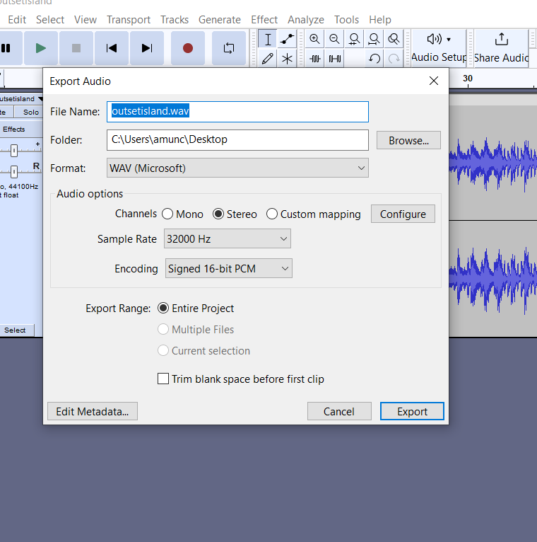
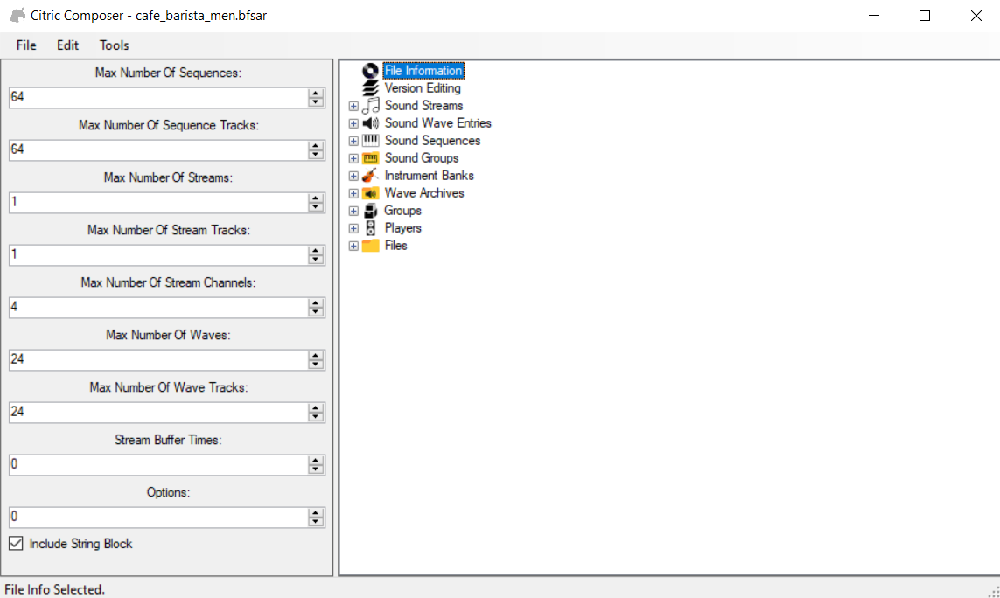
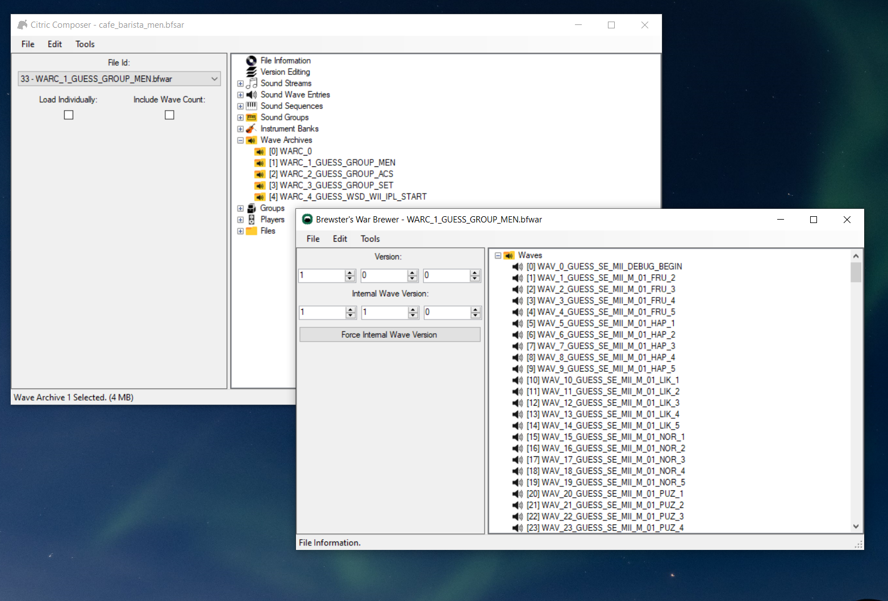
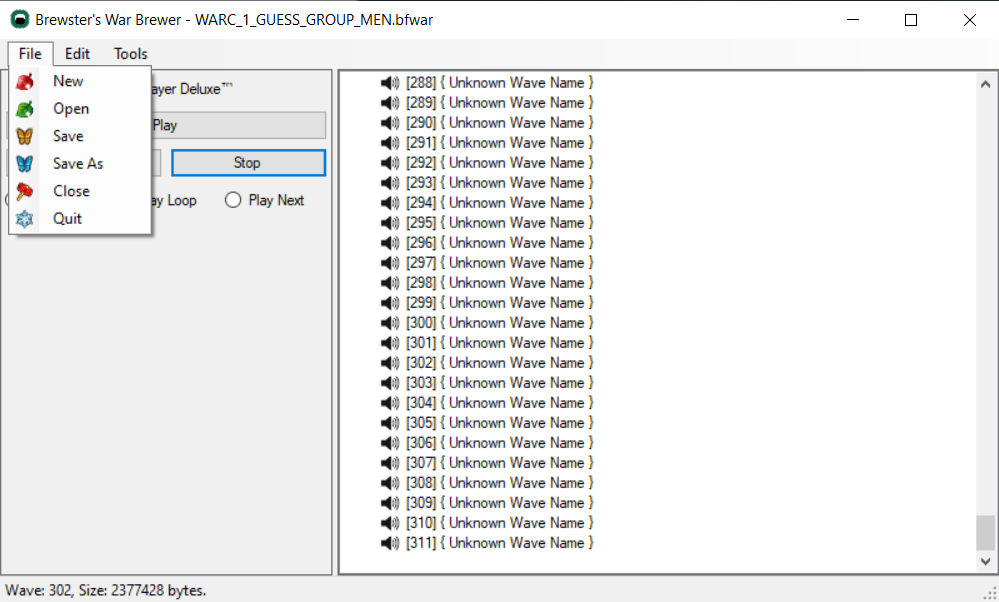
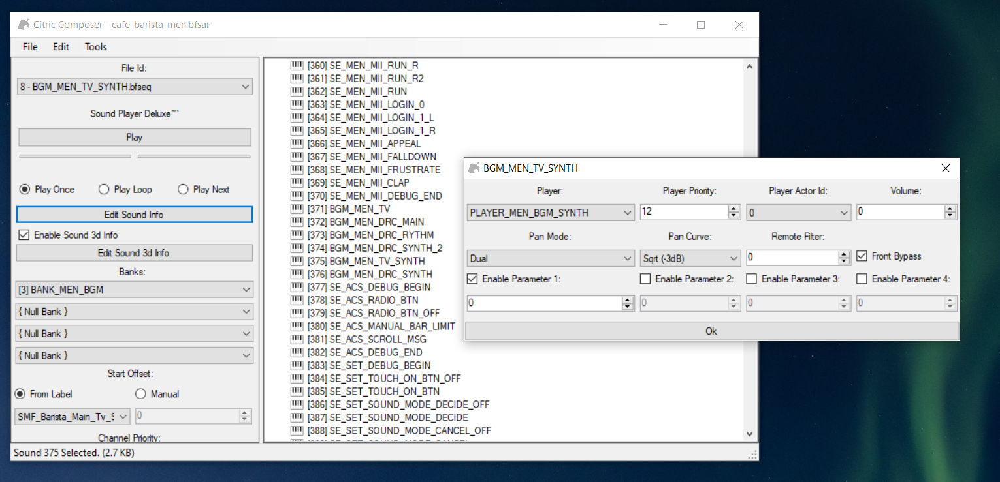
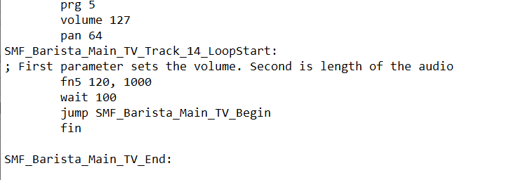
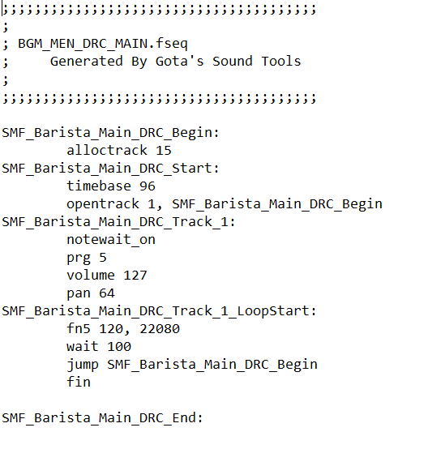

**Custom Background Music Tutorial**

- Tools & Files Needed

• Citric Composer - <https://gota7.github.io/Citric-Composer/>

• SequenceConvert - <https://github.com/Gota7/SequenceConvert>

• SDCafiine - <https://github.com/wiiu-env/sdcafiine_plugin>

• Unmodified cafe_barista_men.bfsar file

• Audio program for converting audio files to WAV format (Audacity works well)

---------------------------------------------------------------------------

⚠️  If you follow this tutorial *please* use SDCafiine as these modifications are a WIP and things might not be stable! ⚠️ 

1. Converting the audio you want to use for background music is pretty simple as all you need to convert the file to is a WAV Format
(Keep in mind the size of the audio file as files that are too large simply won't work)

2. Next, launch Citric Composer and open your unmodified bfsar file.

3. Expand the Wave Archives drop down and double click [1]WARC_1_GUESS_GROUP_MEN

4. Scroll to the bottom of the archive and find [302] WAV_302_GUESS_BANK_MEN_BGM. Right click this file and select replace.

5. Choose your newly created WAV file you want to replace the current music with.

6. To add on to the size of files playing a role in whether or not this will work, you will want to replace all of the other existing BANK_MEN_BGM files with blank WAV files.

7. After you've replaced all of the relevant files, save the file (you are done with Wave Archives now).

8. Navigate to the Sound Sequences drop down and find BGM_MEN_TV. Right click the file and select export.

9. Now that you've exported the file you want to drag and drop the file over SequenceConvert.exe. This should create a new .fseq file that you can read and edit the values in a text editor of your choice.

10. There's quite a bit going on in this file, so I've provided an example file for this tutorial with some changes.

11. The sound file we replaced with our custom music is playing in SMF_Barista_Main_TV_Track_14_LoopStart. The two lines you will likely want to change (unless your music duration is the same as my example) are the two values after fn5. The first value is responsible for the volume of the audio and the second one changes the duration/fadeout time of the file. I still haven't figured out exactly what the units of the duration represent, so it might take some trial and error to get your audio looping how you want.

12. In the attached file I've provided it's important to note that the volume of the other unwanted audio files has been muted.

13. After you've made the changes you want, it's time to save this file and do the same process of dragging and dropping the file over SequenceConvert. Similarly, this should provide a new and updated BGM_MEN_TV.bfseq file that can replace the original one in Citric Composer.

14. Next, once the BGM_MEN_TV file is replaced I recommend changing the volume of BGM_MEN_TV_SYNTH to 0 as you most likely don't want the default idle music to play over the music you have chosen.

15. Finally, once you have gotten the files replaced it is time to save cafe_barista_men.bfsar.

16. To see if the changes you've made turned out the way you want, you can use SDCafiine to safely test any of the changes you've made without fear of any potential brick risk (similar to replacing men/men2 files for themes).

17. In order to add the modified music to an existing theme you will want to add a folder named "Sound" inside of your common folder. Inside of the Sound folder create another folder titled "Men". Lastly, place your updated cafe_barista_men.bfsar file in this new Men folder. Everything should be ready for testing, and if all went well you should have looping custom background music :)

<video controls>
<source src="../imgs/music/vm.mp4" type="video/mp4">
</video>

---------------------------------------------------------------------------------------------------------------
Keep in mind that there are some issues with this as for whatever reason Citric Composer breaks some of the default menu sounds and I have yet to fix this. I'm sure this isn't that hard of an issue to deal with and it will likely be solved in the near future.

oh yeah here's the blank.wav almost forgot

[Blank.wav](files/blank.wav){ .md-button } 

---------------------------------------------------------------------------------------------------------------

UPDATE:
I've created a template file for adding music with the added menu sfx fix as well as gamepad music. The programs listed at the beginning of this thread are still necessary, although this template has already done a lot of the previous work for you.

As far as music goes, I recommend using the same output options in the image provided (must use WAV). With these settings I found for the maximum audio length to be around 1:55 before the file would be too large to work.

Once you have the audio converted to the correct format, open Citric Composer. Next, open the template BFSAR file. Expand the Wave Archives area and double click [1] WARC_1_GUESS_GROUP_MEN.

Scroll to the bottom of the window and find wave 302. Right click and replace this file with the audio file of your choice.

Save this window to update your changes. Now expand the Sound Sequences area.

The highlighted sequences (BGM_MEN_TV & BGM_MEN_DRC_MAIN) are what you will want to modify in order to get your audio looping properly.

Open the BGM_MEN_TV file and find "fn5 120, 1000".

To adjust the volume you can change the first value, 120, to be lower or higher. The second value, 1000 in this example, is the length of the audio that will play.

To calculate and update this value in order to match the length of your song you will want to take the number of seconds your song is and multiply that value with 192.

For example, a 1:55 song is 115 seconds, so you would multiply (115 * 192) in order to find the appropriate value.

The BGM_MEN_DRC_MAIN file is more or less the same as the other file, so you will want to make the same changes to this file as you did to the other. Having differences in audio length between these two files would cause music to not sync properly.

Once you have converted these .fseq files back to .bfseq format, you can now replace the existing files with your updated ones.
Finally, save the file. Remember to rename the template BFSAR to "cafe_barista_men".

BFSAR Template (fixed sfx)

Made by dewgong:

[cafe_barista_men (MII SFX)](base/music/cafe_barista_men%20(MII%20SFX).bps){ .md-button } 

Template with muted Mii sfx (music can be a bit longer as the Mii sounds take up a bit of space):

[cafe_barista_men (NO MII SFX)](base/music/cafe_barista_men%20(NO%20MII%20SFX).bps){ .md-button } 

At 32khz, I found that the max length was 2:26 (stereo)