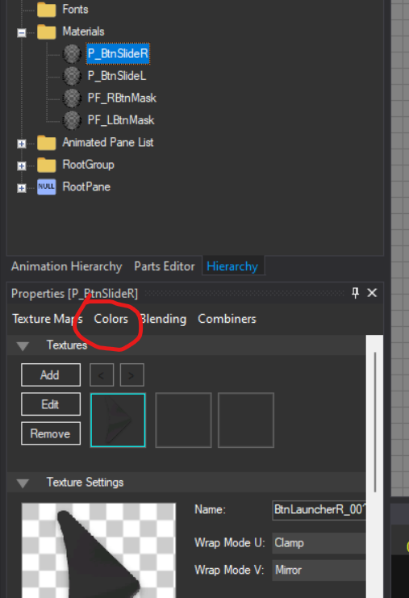
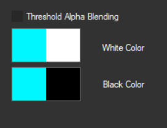
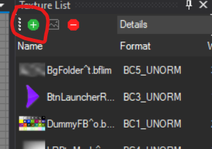
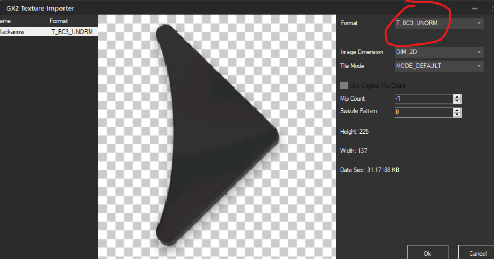
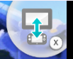

**Getting Started for Theme Creators**

I dont know if this is useful or not but since the server was updated ill make a full course for new theme creators so if you are planning in making your own wii u themes you can use this tutorial and get started!

--------------
Getting Started:

You will need:

- Switch Toolbox (https://github.com/KillzXGaming/Switch-Toolbox?tab=readme-ov-file)
- your original Men.pack, Men2.pack, cafe_barista_men.bfsar files

--------------
Select a base:

We have made a couple bases so you can make your themes way easier!
Select the one that suits you the best depending on what you want to achieve

- [Static single image](base/newcreator/LofiIPS1.zip){ .md-button } 

Single image on both screens

- [Static double image](base/newcreator/BPSY2K.zip){ .md-button } 

Two different images on both screens

- [Static with wwp](base/newcreator/BPSLOFI2.zip){ .md-button } 

A static theme with wara wara plaza

- [Menu only](base/newcreator/KirbyBPSBASE.zip){ .md-button } 

This is an improved version of the static with wwp

--------------
Patching:
After downloading your base you will need to patch your original files with the base file, you will need:

- Rom Patcher JS (<https://www.marcrobledo.com/RomPatcher.js/>)

If you have any question on how to patch your original files go [here](../../install/patching.md)

--------------
Adding a custom image:

*Depending on the base you chose follow the tutorials below*

- Static single image [here](static.md)

- Static double image [here](static.md)

- Static with wwp [here](static.md)

- Menu only (No tutorial)

--------------
Painting your theme:

*After adding a custom image to your theme you may want to go further and change the colors on your theme*

- Changing arrow colors

1. Open Men2.pack
2. Search for "BtnSlideLauncher.szs"
3. Double click it and open BtnSlideLauncher.arc > blyt > BtnSlideLauncher.bflyt
4. Open Materials
5. Select P_BtnSlideR
6. Below the navigator click colors

7. Change the black color to the color you want on your theme arrows
8. Do the same with P_BtnSlideL
9. Save

- Changing active frame colors

This is an active frame:

1. Open Men2.pack
2. Search for "Launchericon.szs"
3. Double click it and open Launchericon.arc > blyt > Launchericon.bflyt
4. Open Materials
5. Select ActiveFrame
6. As we did before open colors
7. This time you will change both colors to the color you like

8. Save

- Changing OverlayAppBase colors

1. Open Men2.pack
2. Search for "OverlayAppBase.szs"
3. Double click it and open OverlayAppBase.arc > blyt > OverlayAppBase.bflyt
4. Open Materials
5. Change the color of every P_base
6. Save

- Changing Folder Arrow colors

I was lazy so i didnt fix the bases before uploading them so you may see they look purple **(if this is not the case for you, you can skip this part)**

1. Open Men2.pack
2. Search for "BtnSlideFolder.szs"
3. Double click it and open BtnSlideFolder.arc > blyt > BtnSlideFolder.bflyt
4. We are gonna add a black arrow picture to work with

Download this image as a **png**

5. Click the add button

6. Add the arrow with the format **BC3_UNORM**

7. Open Materials
8. Click P_BtnSlideR
9. Click edit

10. Do the same with P_BtnSlideL

11. Now we can start coloring

12. Click P_BtnSlideR and click colors, change the black color to the color you like
13. Do the same with P_BtnSlideL

**Now that we know how to change colors here is a list of things you may wanna change colors of**

**Men2.pack > PageIndicator.szs**

**Men2.pack > UsbIndicatorDrc.szs**

**Men.pack > BtnSwapDrc.szs (gamepad)**
**Men.pack > BtnSwap_00.szs (tv)**

**Men.pack > BtnLoungeScale_00**

