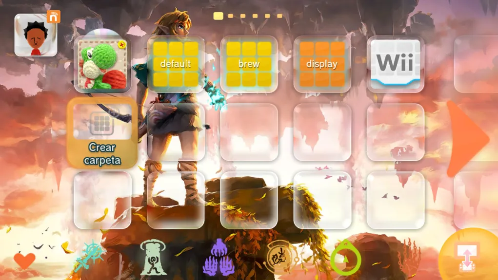
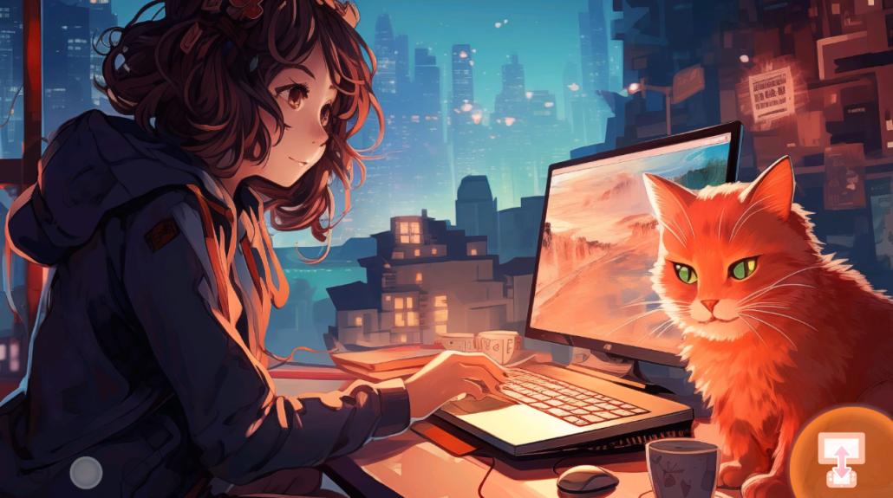
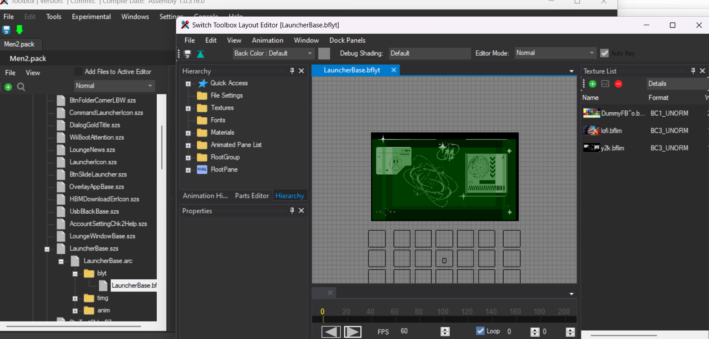
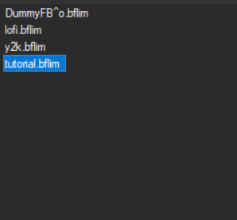
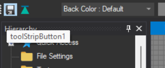
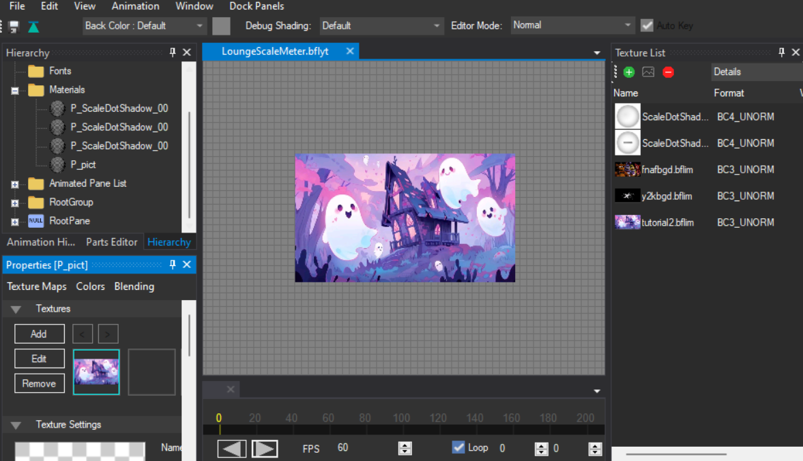

So, how to make static themes

"Static" themes are the themes that have a 2D non-moving image

1. Select your style
    static themes can come in different ways

    **double images**

    

    

    **single images**

    

    

    choose which one you wanna use as a base

    ------------------------------
    **if you already got a base you can skip this**
    My suggestions for this tutorial are:

    Y2K Theme: 

    [Download here](base/newcreator/BPSY2K.zip){ .md-button } 

    It contains all the icons ready to modify that means easy change of colors and double image

    Lofi1 Theme Version (A): 

    [Download here](base/newcreator/LofiIPS1.zip){ .md-button } 

    It contains all the icons ready to modify that means easy change of colors and single image

    Lofi1 Theme Version (B):

    [Download here](base/newcreator/BPSLOFI2.zip){ .md-button } 

    It contains all the icons ready to modify that means easy change of colors, it contains the wara wara plaza

    How to use them?

    You need to patch the themes previously mentioned with your original files read more about patching on [here](../../install/patching.md)
    **if you already got a base you can skip this**
    ------------------------------

2. open **Men2.pack** with switch toolbox and search for **LauncherBase.szs**  > **blyt**  > **LauncherBase.bflyt**

    

    add any image you want with the **green button** on the right corner of the screen

    

    **For this tutorial we will be using this image**

    

3. When adding the image make sure you change the **format** to **BC3_UNORM**

    

    press Ok

4. Open **materials** > **P_pict_0** and click edit

    

5. Select your image

    

6. Save

    

7. Now we will change the second image

    **Skip the following steps if you are using a single image static or a wara wara plaza static**

    Do the same process we did before but with **LoungeScaleMeter.szs**

    

    We will be using this image

    

8. For the last step we will change the 3D image for the image we added on **LauncherBase**

    Open **Model** > **FloatIcon00.szs** > **Textures** > **heisjustlikeme**

    

    Click right click **replace** and select your image

    this time the format will stay as default **BC1_UNORM**

    

    press Ok, save and profit

    
    