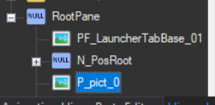
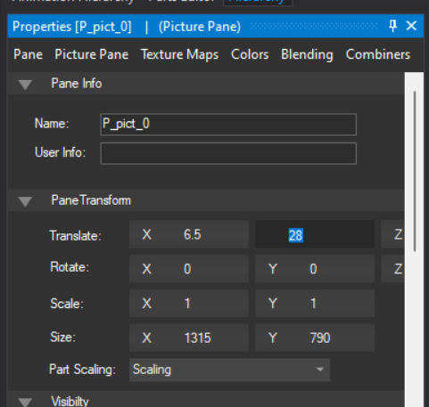
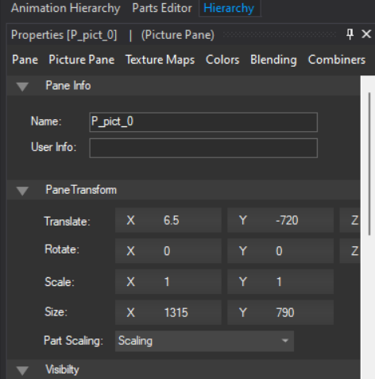
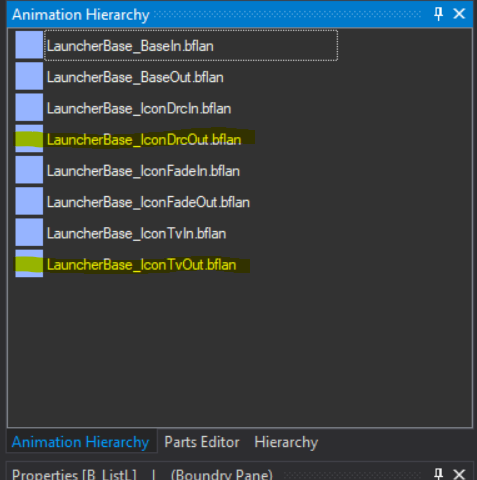

**Converting a static into a static with Wara Wara Plaza**

1. Open **LauncherBase.szs** > **LauncherBase.bflyt**

    

2. Open RootPane and select **P_pict_0**

    

3. Select Pane > Translate and change the Y axis to **-720**

    
    

4. Now drag **P_pict_0** into **N_PosRoot**

    

5. Open Animation Hierarchy, we will just change a couple stuff on this 2 animations

    

6. Open **LauncherBase_IconDrcOut** and change Key Frame 2's value to 1000 like the picture below

    

    Do the same with **LauncherBase_IconTvOut** but in negative -1000

    

    What we are doing here is:

    1. animating it so the top and bottom of the picture doesnt show on screen
    2. why negative? you can change it to possitive too, you can choose which direction you want to animate it, thats all on you

7. Save and test

<video controls>
<source src="../imgs/statictowwp/v1.mp4" type="video/mp4">
</video>
