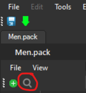

# Custom Cursor

!!! abstract

    Credits to the discord user *@dot0451* for the information in this page

Requirements:

- [Switch Toolbox](https://github.com/KillzXGaming/Switch-Toolbox?tab=readme-ov-file)
- Your original Men.pack file

To get your original Men.pack file you will need to follow the tutorial on [Menu Files](../install/files.md) and come back 

--------------

Instructions:

- Drag Men.pack Into Swich Toolbox

- Search for "Cursor.szs"

Once you find it, double click it to reveal '**Cursor.arc**,  and double click '**Cursor.arc** to reveal more folders.

We will be focusing on two folders.
- **blyt**
- **anim**

And the files inside of them. **(Cursor.bflyt, Cursor_CursorNumber.bflan)**

We will focus on **blyt** folder for now. 

Double click the file **Cursor.bflyt**

Inside of it, there will be a **Materials** folder.

Open it, and it should reveal 4 files inside: **(CursorBase, CursorBaseShadow, CursorBaseAlpha, CursorBaseBlur)**

I recommend you start from top to bottom. 

You want to click on any of the four files, and click **color** at the bottom

Not a lot is understood about how the colors work, but...

- You can edit the left side colors, but **make sure you copy down your hex codes** somewhere if you wish to revert back or if you're copying it to the other CursorBase files.
- A rule of thumb is to always keep the right side colors untouched. They should either be only black or white. They might change while you're editing the left side colors, so just change them back.
- If you see no change in the cursor color, you either leave it as is, or revert it back. Not sure if it matters, but it's your choice.

After you are satisfied with how the cursor looks, click the save button located at the top left. It should say **Saved Cursor.bflyt to archive** and make sure you save the project in case anything happens.

--------------
Now time for the anim folder. There is a file called **Cursor_CursorNumber.bflan** double click it to open it.

Expand that window.

We will be focusing on these. They have RGB color coding that we need to change.

**Remember when I asked you to keep your hex codes somewhere? This is where they come in.**

A good website to change hex colors to RGB: [Click here!](https://www.rapidtables.com/convert/color/hex-to-rgb.html)

As you see, I'm using white so the RGB for Red, Green, and Blue are all 255

They will differ depending on your hex code.

**We will only change the Value of KeyFrame0, and KeyFrame1 for Red, Green, and Blue respectively**

Edit the values with the corresponding numbers that you get from that website.

Without closing the tab, save it.

Then close that window and save the project again.

!!! success

    That's it, you're done!